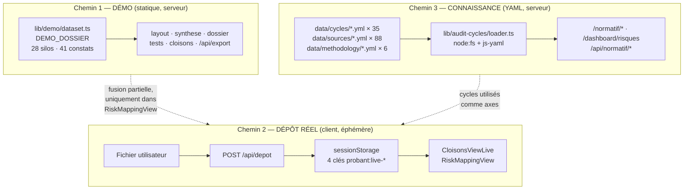
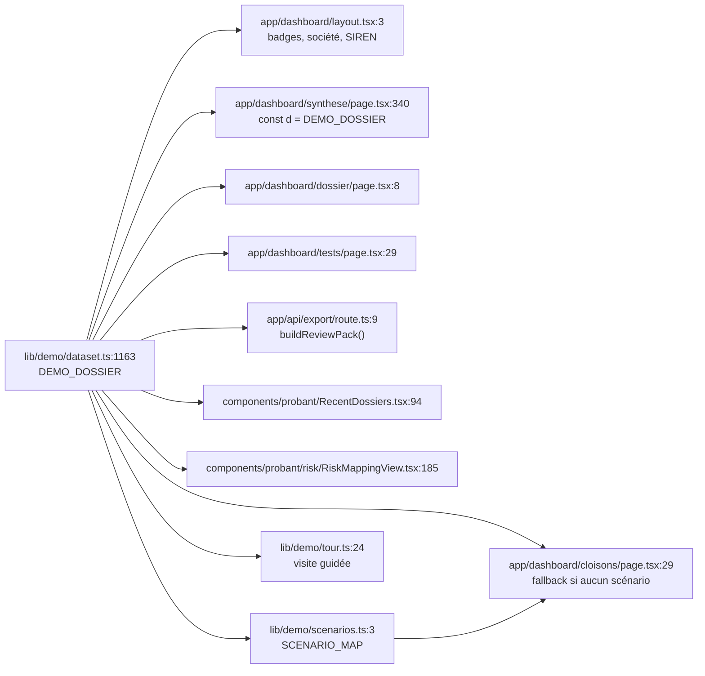
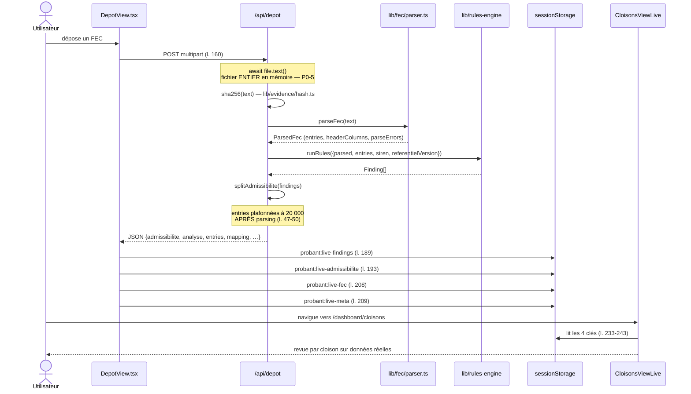
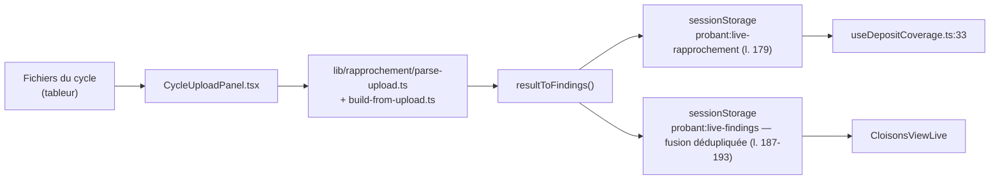
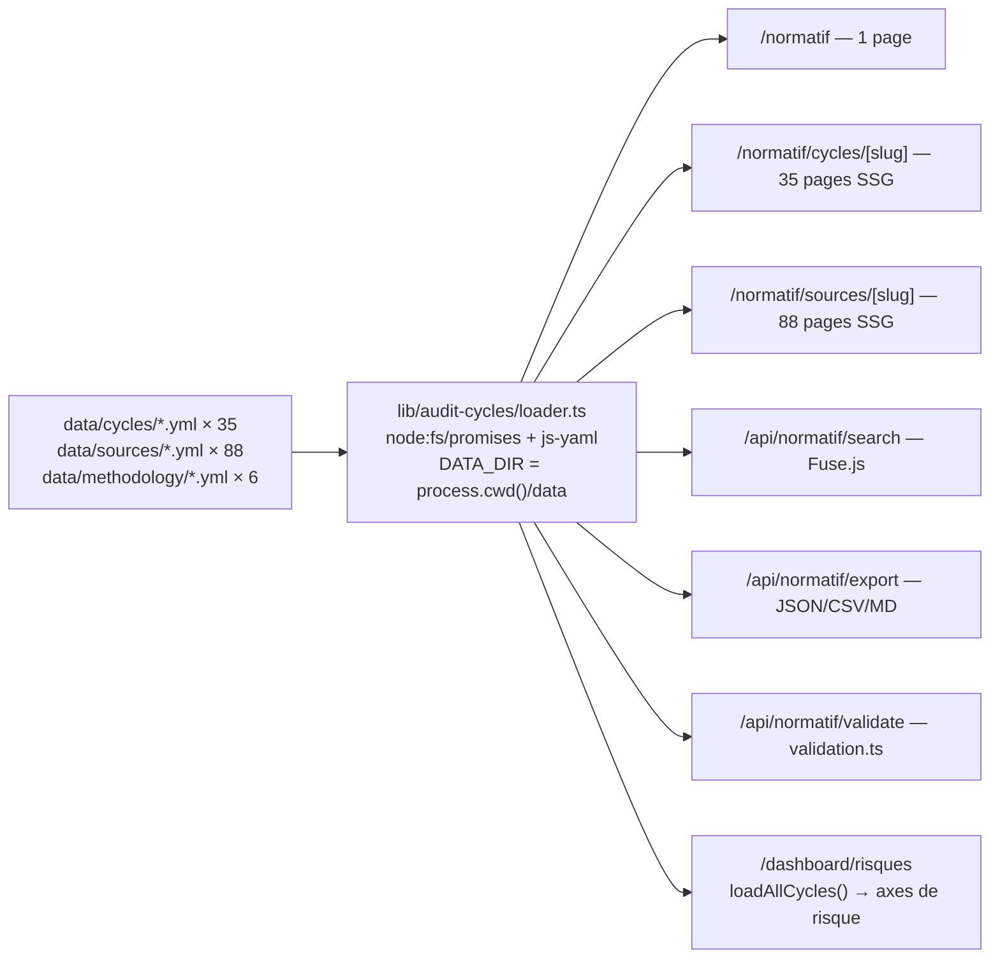
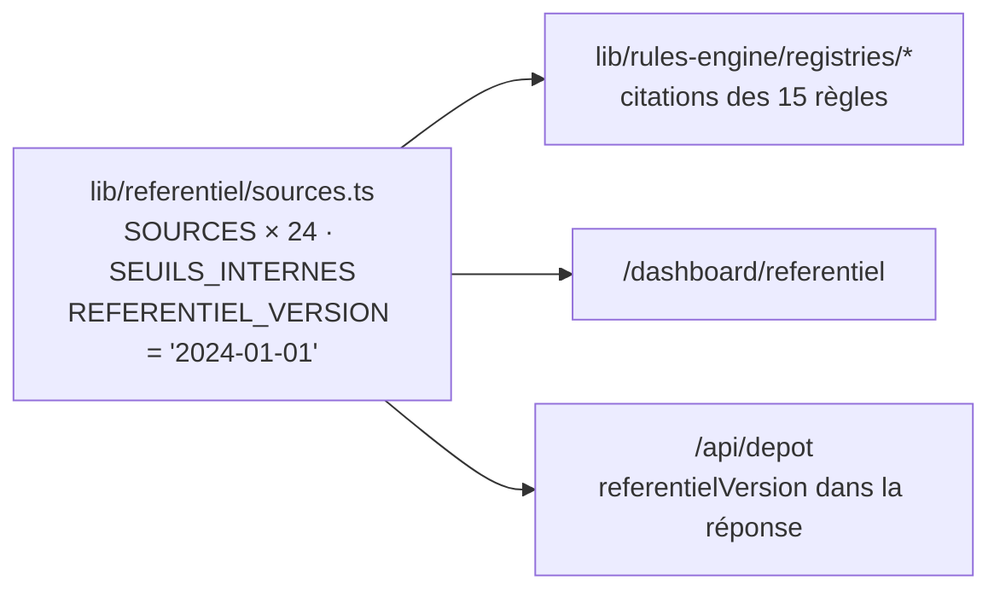
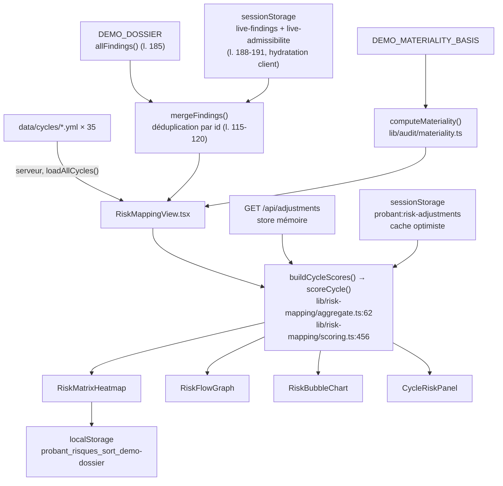
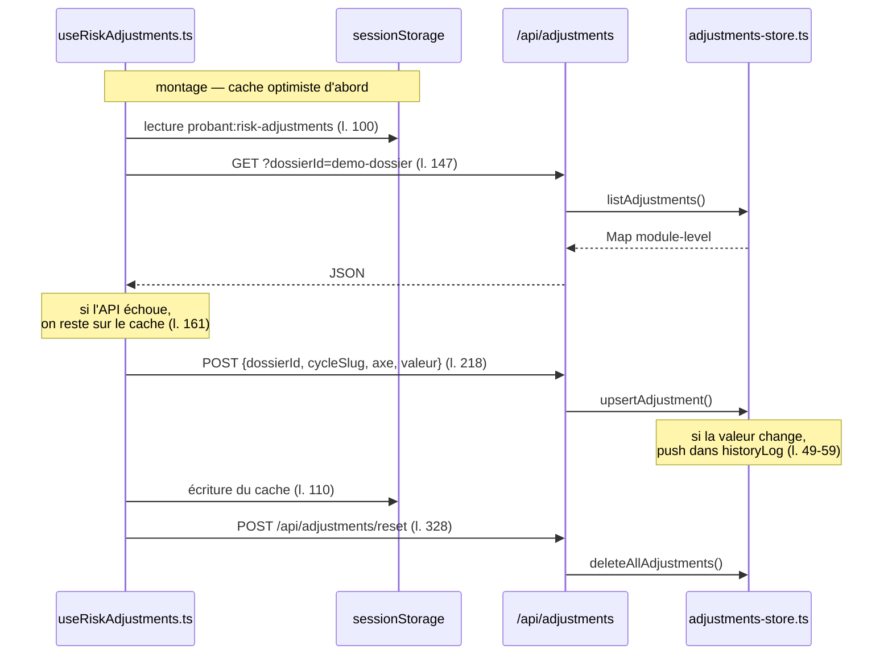

# PROBANT — Flux de données réels

> **Commit audité** : `e61ae741df1694a5beadb76ddaeee8cb7d79b0e6`
> Ce document décrit les flux **tels qu'ils existent**, pas tels qu'ils
> devraient être. Pour la cible, voir [`TARGET_ARCHITECTURE.md`](./TARGET_ARCHITECTURE.md).

---

## 1. Vue générale — trois chemins indépendants

Il n'existe pas *un* flux de données dans PROBANT, mais **trois chemins qui ne se
rejoignent jamais** — c'est la traduction technique du P0-4.

Seule la Cartographie des risques (`/dashboard/risques`) fusionne les trois. La
Synthèse (`/dashboard/synthese`) n'en voit **qu'un seul** : le chemin démo.

---

## 2. Chemin 1 — le dossier de démonstration

**Aucune persistance.** La démo est reconstruite à chaque rendu depuis un module
TypeScript statique. C'est ce qui garantit que le mode DEMO SA fonctionne sans
base ni credentials — propriété à préserver.

---

## 3. Chemin 2 — dépôt réel d'un FEC

### Ce que ce chemin **ne fait pas**

- Il n'écrit **rien** côté serveur. `/api/depot` est un pipeline pur.
- Il ne survit **pas** à la fermeture de l'onglet (`sessionStorage`).
- Il n'atteint **jamais** `/dashboard/synthese`, qui reste câblée sur la démo.
- Le SIREN est extrait du **nom de fichier** par expression régulière
  (`/^(\d{9})FEC/iu`, `app/api/depot/route.ts:34`) — `null` sinon.

### Variante — dépôt par cycle (rapprochement)

Ce chemin **s'exécute entièrement dans le navigateur** — il n'appelle aucune
route API. C'est aussi lui qui consomme `xlsx@0.18.5` via
`lib/balance/parse-xlsx.ts:21` (`await import("xlsx")`) → surface de **P0-1**.

---

## 4. Chemin 3 — base de connaissance normative

`next.config.ts:6-8` embarque `./data/**/*` dans le tracing de fichiers de chaque
fonction serverless — condition nécessaire au fonctionnement de `loader.ts` en
production.

**Le registre TypeScript `lib/referentiel/sources.ts` (24 sources) n'apparaît pas
dans ce flux.** Il alimente un chemin distinct :

→ **P1-1** : deux registres normatifs, deux flux, aucune réconciliation.

---

## 5. Cartographie des risques — le seul point de fusion

Le motif d'hydratation est explicite (`liveFindings: Finding[] | null`, sentinelle
`null` = pas encore hydraté, `RiskMappingView.tsx:186`) : le premier rendu serveur
n'ignore jamais silencieusement des constats déposés côté client.

---

## 6. Ajustements de jugement — le seul aller-retour serveur avec état

**Durée de vie réelle** : la `Map` et le `historyLog` vivent dans le process
Next.js. Un redéploiement, un redémarrage, ou une seconde instance serverless
suffit à les perdre — ou à servir un état différent. C'est explicitement assumé
dans `lib/server-store/adjustments-store.ts:1-12`.

---

## 7. Ce qui n'existe pas dans les flux

| Absent | Vérification |
|---|---|
| Base de données | Aucune dépendance de driver ni d'ORM dans `package.json` |
| Stockage objet | Aucun appel de stockage dans `app/` ou `lib/` |
| Authentification / session serveur | Aucun `middleware.ts`, aucun cookie émis |
| Appel réseau sortant vers un tiers | `lib/analytics/track.ts` ne poste que vers `/api/analytics/events` |
| File d'attente / job asynchrone | Le parsing est synchrone dans la requête HTTP (P0-5) |
| Export PDF | `lib/evidence/export.ts` produit un `ReviewPack` **JSON** |
