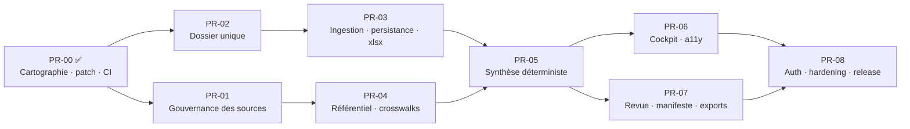

# PROBANT — Roadmap PR-00 → PR-08

> Cette roadmap **reprend et précise** la séquence déjà arrêtée dans
> [`docs/refonte/PLAN_REFONTE.md`](../refonte/PLAN_REFONTE.md) et suivie dans
> [`docs/refonte/SUIVI_AVANCEMENT.md`](../refonte/SUIVI_AVANCEMENT.md).
> Elle ne la remplace pas : `SUIVI_AVANCEMENT.md` reste le tableau de bord
> d'exécution. Ce document ajoute, pour chaque PR, **ce que la cartographie de
> PR-00 a effectivement prouvé** et qui conditionne son périmètre.

---

## 1. Séquence

---

## 2. Tableau

| PR | Objet | Prérequis | Statut | P0/P1/P2 traités |
|---|---|---|---|---|
| **PR-00** | Cartographie, patch de maintenance, CI minimale | — | ✅ **Livré** | P0-2, P0-3, P0-6 résolus ; P0-1, P0-5 documentés |
| **PR-01** | Gouvernance des sources et modèle de connaissance | PR-00 | ⬜ | P1-1 (registre unique), P1-3 (tests règles) |
| **PR-02** | Dossier unique — fin de la divergence DEMO / réel | PR-00 | ⬜ | **P0-4** |
| **PR-03** | Ingestion, persistance, stockage objet, remplacement `xlsx` | PR-02 | ⬜ | **P0-1**, **P0-5** |
| **PR-04** | Référentiel PCG / NEP / IFRS et crosswalks | PR-01 | ⬜ | suite de P1-1 |
| **PR-05** | Moteur de Synthèse déterministe | PR-03, PR-04 | ⬜ | P1-4, P1-6 |
| **PR-06** | Cockpit, infographies, accessibilité | PR-05 | ⬜ | P1-5 (boutons), P2-4 |
| **PR-07** | Revue append-only, manifeste, exports | PR-05 | ⬜ | P1-5 (workflow de décision), P2-5 |
| **PR-08** | Auth, hardening, E2E, observabilité, release | PR-06, PR-07 | ⬜ | **P1-2**, P2-2, P2-3 |

---

## 3. PR-00 — ce qui a été livré

**Fichiers créés**

- `docs/architecture/PROBANT_MASTER_CONTEXT.md`
- `docs/architecture/CURRENT_STATE_MAP.md`
- `docs/architecture/TARGET_ARCHITECTURE.md`
- `docs/architecture/DATA_FLOW.md`
- `docs/architecture/PR_ROADMAP.md`
- `docs/architecture/DECISION_LOG.md`
- `.github/workflows/ci.yml`
- `eslint.config.mjs`

**Fichiers modifiés** : `package.json`, `package-lock.json`, `README.md`,
`docs/README.md`, `docs/refonte/SUIVI_AVANCEMENT.md`.

**Aucun fichier de `app/`, `components/`, `lib/` ou `data/` n'a été touché.**

---

## 4. Périmètre recommandé pour PR-01

> **Objet** : gouvernance des sources et modèle de connaissance.
> **Prérequis** : PR-00 fusionné, CI verte sur `main`.
> **Ce que PR-01 ne fait pas** : ne touche à aucune page, ne retire aucun import
> `DEMO_DOSSIER`, ne remplace pas `xlsx`, ne modifie aucun résultat métier.

### 4.1 Ce que la cartographie a prouvé et qui fonde ce périmètre

| Constat | Preuve |
|---|---|
| Deux registres normatifs concurrents : **24** sources TS vs **88** sources YAML | `CURRENT_STATE_MAP.md` § 9.1 |
| `lib/referentiel/sources.ts:5-6` se déclare à tort « **la SEULE** source de vérité » | lecture du fichier |
| Les **15 règles** du moteur (10 `hardLaw`, 3 `methodology`, 2 `internal`) n'ont **aucun test** | `CURRENT_STATE_MAP.md` § 9 |
| `lib/fec/parser.ts` (5 exports publics) n'a **aucun test** | idem |
| `vitest.config.ts` ne couvre que `lib/**` — cette PR reste donc dans son périmètre naturel | `vitest.config.ts:8` |
| Le contrôle qualité YAML existe déjà et est testé (8 tests) | `lib/audit-cycles/validation.ts` |

### 4.2 Périmètre exact proposé

1. **Unifier le registre de sources.**
   Décider et consigner (ADR) laquelle des deux représentations devient
   canonique. La cartographie oriente vers **YAML** (88 entrées, déjà validées,
   déjà versionnées, déjà testées) avec `lib/referentiel/sources.ts` réduit à une
   **vue dérivée typée** des 24 sources utilisées par le moteur de règles —
   afin que les citations des 15 règles restent **identiques au caractère près**.
2. **Valider le registre par Zod** aux frontières de chargement
   (`lib/audit-cycles/loader.ts`), conformément à `CLAUDE.md` (« Add types and
   validation boundaries », « No untyped JSON »).
3. **Remplacer `REFERENTIEL_VERSION`** (chaîne figée `"2024-01-01"`,
   `lib/referentiel/sources.ts:16`) par une version de connaissance explicite,
   propagée dans les constats. Le champ existe déjà dans la réponse de
   `/api/depot` — il s'agit de le rendre traçable, pas de l'inventer.
4. **Écrire les tests manquants du plan de connaissance** — sans modifier
   aucune règle :
   - `lib/fec/parser.ts` : `detectSeparateur`, `parseMontant`, `parseFec`,
     `headerConformite` ;
   - `lib/rules-engine` : un test de **caractérisation par règle** (les 15),
     figeant le comportement actuel avant tout refactor ultérieur ;
   - `lib/referentiel/sources.ts` : test d'intégrité (toute `SourceKey` citée par
     une règle existe dans le registre).
5. **Produire `docs/knowledge/`** : politique de sources, couverture normative,
   et surtout `REVIEW_REQUIRED.md` listant les citations et seuils **à faire
   valider par un expert audit** — le README l'exige déjà (l. 86-88, 114).

### 4.3 Critères de sortie de PR-01

- [ ] Un seul registre canonique ; l'autre est une vue dérivée, sans duplication
      de contenu.
- [ ] Aucune citation modifiée : diff de sortie des 15 règles **identique** avant
      et après (test de caractérisation à l'appui).
- [ ] Aucune confusion NEP / ISA ni IASB / adoption UE introduite.
- [ ] Zod aux frontières de chargement ; aucun JSON non typé.
- [ ] `REVIEW_REQUIRED.md` exhaustif et daté.
- [ ] CI verte : `lint`, `typecheck`, `test`, `build`.
- [ ] Le mode DEMO SA rend exactement les mêmes constats qu'avant.

### 4.4 Risques identifiés pour PR-01

| Risque | Mitigation |
|---|---|
| Fusionner les registres change une citation affichée | Test de caractérisation **écrit d'abord**, sur les 15 règles |
| Les 88 sources YAML et les 24 sources TS ne se recouvrent pas exactement | Produire la table de correspondance **avant** de toucher au code ; `TODO` explicite pour toute source sans équivalent |
| Zod rejette un YAML existant | Faire échouer la CI, pas le runtime ; corriger la donnée, jamais assouplir le schéma en silence |

---

## 5. Rappel des blocages qui traversent la séquence

| # | Blocage | Ne peut être levé que par |
|---|---|---|
| **P0-1** | `xlsx@0.18.5` — aucun correctif publié (`fixAvailable: false`) | **PR-03** + ADR-003 |
| **P0-4** | Trois sources de vérité | **PR-02** |
| **P0-5** | `/api/depot` parse le fichier entier dans la requête HTTP | **PR-03** |
| **P1-2** | 6 vulnérabilités transitives résiduelles | **PR-08** |

Tant que **P0-1** n'est pas levé, `npm audit` restera non bloquant en CI
(voir [`DECISION_LOG.md`](./DECISION_LOG.md) § D-003).
