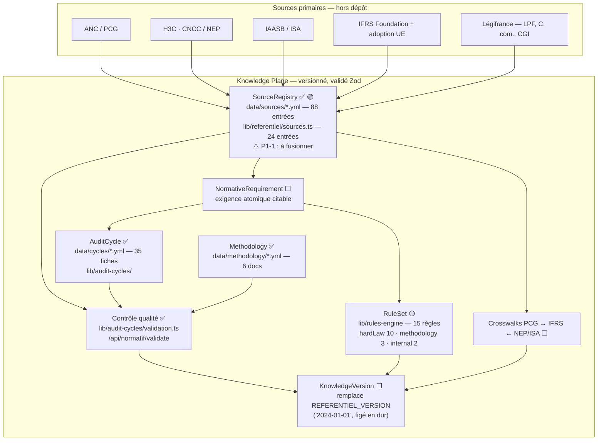
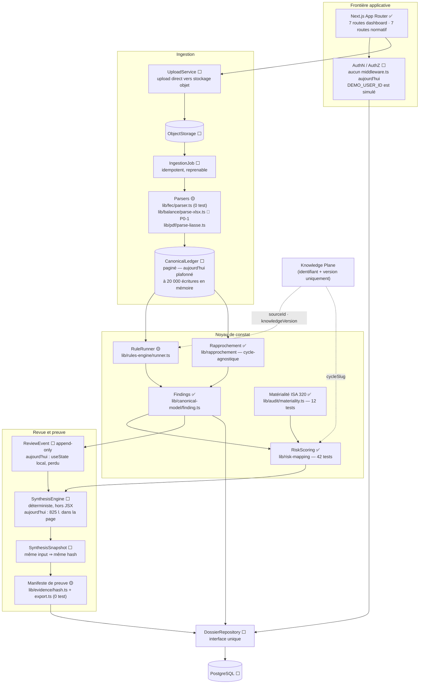
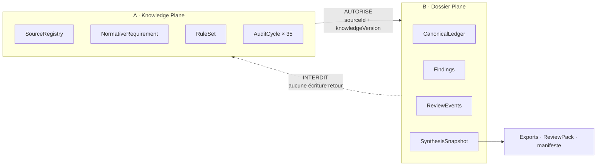

# PROBANT — Architecture cible

> ⚠️ **Rien de ce document n'est implémenté.** C'est une cible, produite par
> PR-00 pour cadrer PR-01 → PR-08. L'état réel du dépôt est décrit dans
> [`CURRENT_STATE_MAP.md`](./CURRENT_STATE_MAP.md).
> Chaque brique est marquée : ✅ existe déjà · 🟡 existe partiellement · ⬜ à créer.

---

## 1. Le principe : deux plans qui ne se mélangent jamais

Le défaut structurel constaté (P0-4 : trois sources de vérité concurrentes)
vient de ce que **la connaissance normative et les données d'un dossier client
sont manipulées par les mêmes chemins de code**. La Synthèse lit `DEMO_DOSSIER`,
la Cartographie lit à la fois `DEMO_DOSSIER`, `data/cycles/*.yml` et
`sessionStorage`, et le référentiel existe en deux exemplaires (24 sources TS,
88 sources YAML).

La cible sépare strictement :

| Plan | Ce qu'il contient | Cycle de vie | Qui l'écrit |
|---|---|---|---|
| **A. Knowledge Plane** | Sources normatives, exigences, règles, crosswalks, cycles d'audit | **Versionné**, immuable une fois publié | L'équipe PROBANT + revue métier |
| **B. Dossier Plane** | Fichiers déposés, grand livre canonique, constats, décisions humaines, snapshots de synthèse | **Par dossier client**, append-only | L'utilisateur, via l'application |

**Le seul lien autorisé entre les deux plans est un identifiant + une version.**
Un constat du Dossier Plane référence `{sourceId, referentielVersion}` ; il ne
copie jamais le texte de la norme. Cette règle rend un dossier rejouable : un
constat produit sous `referentiel@2024-01-01` reste interprétable après une mise
à jour du référentiel.

---

## 2. Plan A — Knowledge Plane

### Invariants du Knowledge Plane

1. **Registre unique.** Un seul `SourceRegistry`. Aujourd'hui il y en a deux
   (P1-1) et le fichier TypeScript se déclare à tort seule source de vérité
   (`lib/referentiel/sources.ts:5-6`). → **PR-01**.
2. **Aucune citation inventée, aucun texte intégral protégé.** Le registre stocke
   des identifiants, des références et des **paraphrases d'affichage** — jamais
   le texte opposable. C'est déjà la convention en place
   (`lib/referentiel/sources.ts:12`) ; elle devient contractuelle.
3. **Distinction NEP ≠ ISA, IASB ≠ adoption UE.** Deux référentiels voisins ne
   doivent jamais être fondus dans une même entrée. → **PR-04**.
4. **Toute borne chiffrée porte son statut.** `OBLIGATOIRE`, `RECOMMANDE`,
   `BONNE_PRATIQUE`, `PARAMETRABLE`, `A_VALIDER` — mécanisme déjà présent et
   testé (`lib/audit-cycles/validation.ts`, 8 tests).
5. **Le plan est lisible sans dossier.** Une fiche de cycle s'affiche même si
   aucun FEC n'a jamais été déposé — c'est déjà le cas de `/normatif/*`.

---

## 3. Plan B — Dossier Plane

### Invariants du Dossier Plane

1. **Une seule source de vérité par dossier**, derrière `DossierRepository`.
   `DEMO_DOSSIER` devient une **fixture** servie par une implémentation
   `DemoDossierRepository` — il ne disparaît pas, il cesse d'être importé
   directement par 8 modules (§ 3 de `CURRENT_STATE_MAP.md`). → **PR-02**.
2. **`sessionStorage` cesse d'être une source de vérité.** Les 8 clés
   `probant:*` deviennent au plus un cache, derrière une seule façade. → **PR-02**.
3. **Historique de revue append-only.** Une décision (Valider / Accepter /
   Écarter) est un **événement**, jamais un champ écrasé. Aujourd'hui c'est un
   `useState` perdu au rechargement. → **PR-07**.
4. **Synthèse déterministe et hors JSX.** `même input ⇒ même snapshot hash`. Les
   poids et paliers (`WSEV`, `52`, 60/40/20) deviennent des paramètres nommés,
   sourcés et testés. → **PR-05**.
5. **Fail-closed en mode persistant.** Sans identité résolue, le mode persistant
   refuse de servir un dossier plutôt que de retomber sur la démo. → **PR-03**
   (préparation) / **PR-08** (auth).
6. **Le mode DEMO SA reste accessible sans base ni credentials**, sur toute la
   séquence PR-01 → PR-08.

---

## 4. Vue d'ensemble — la frontière entre les deux plans

**Règle de dépendance** : le Dossier Plane dépend du Knowledge Plane ; l'inverse
est interdit. Concrètement, aucun module de `lib/referentiel`, `lib/audit-cycles`
ou `data/` ne doit jamais importer `lib/demo`, `lib/server-store` ni quoi que ce
soit portant un `dossierId`. **Cette règle est déjà respectée** au commit audité
— PR-01 doit la rendre vérifiable automatiquement plutôt que de compter dessus.

---

## 5. Ce que PR-00 n'a délibérément pas fait

- Aucune brique ⬜ n'a été créée.
- Aucun import `DEMO_DOSSIER` n'a été retiré.
- Aucune clé `sessionStorage` n'a été déplacée.
- Aucun poids, seuil ou calcul n'a été modifié.
- `xlsx` n'a pas été remplacé (**P0-1** documenté, porté par PR-03).

Le seul travail de code de PR-00 est un patch de maintenance de Next.js, la
configuration d'ESLint et la CI. `git status` au terme du PR ne montre **aucun
fichier modifié** dans `app/`, `components/` ou `lib/`.
