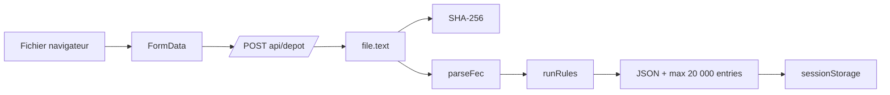
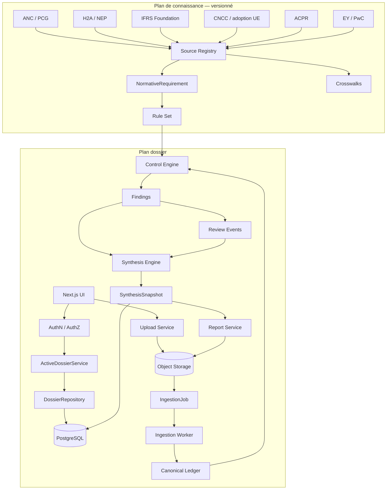
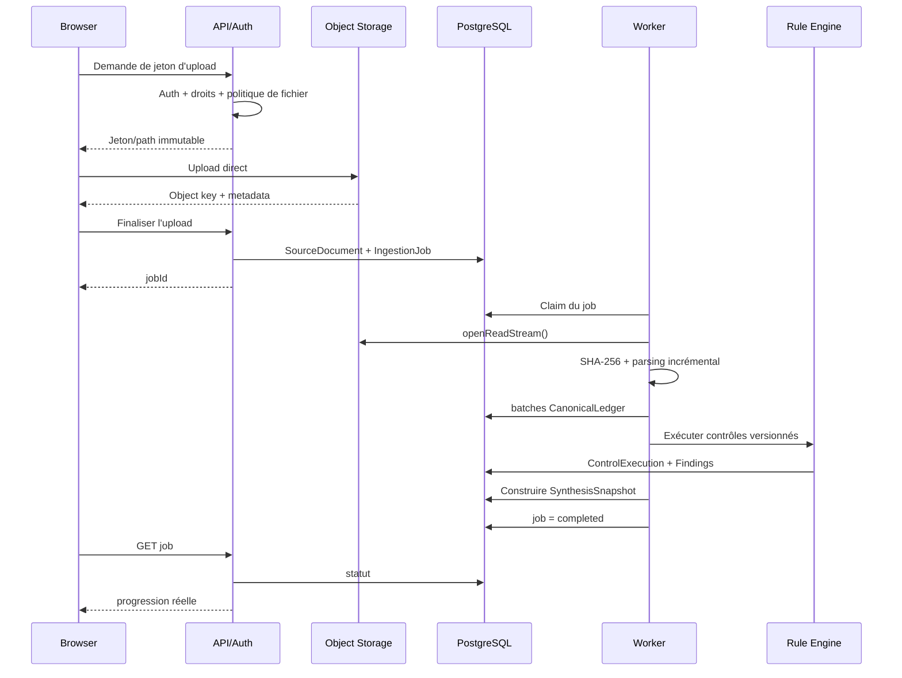
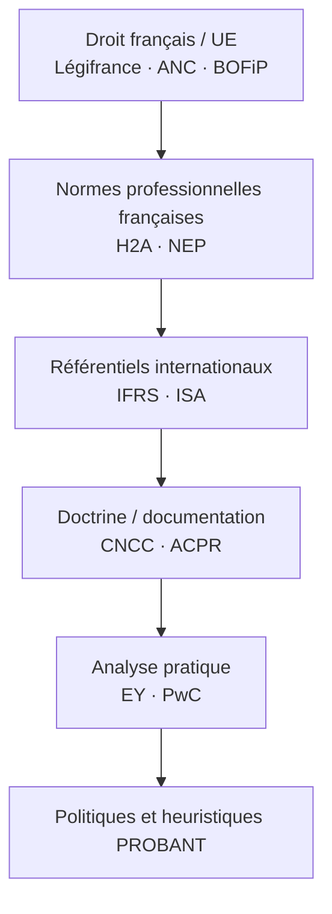
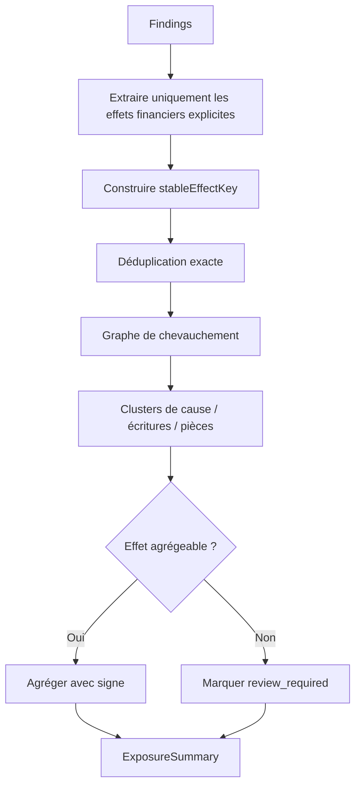
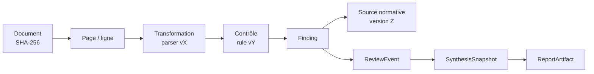
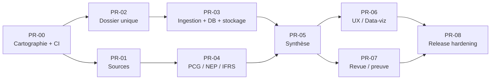
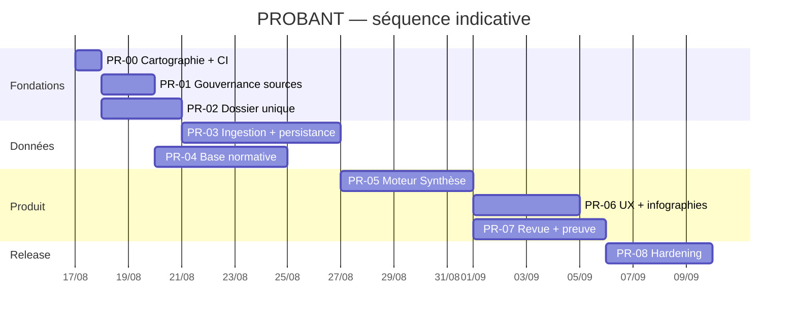
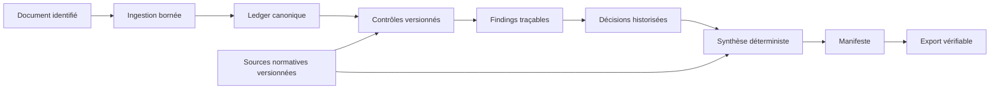

# PROBANT — plan d’architecture et d’implémentation priorisé

> **Document de référence de la refonte PROBANT.**
> Source : audit externe du 13/08/2026 (`PROBANT 130826.md`), déposé tel quel dans le dépôt.
> Ce fichier décrit **le plan**. L'**avancement** est suivi dans
> [`SUIVI_AVANCEMENT.md`](./SUIVI_AVANCEMENT.md) — le plan ne doit pas être réécrit pour
> refléter l'état d'exécution.

| | |
|---|---|
| Statut du document | Adopté comme plan de référence |
| Version | 1.0 — 13/08/2026 |
| Périmètre | PR-00 → PR-08 (le module fiscal est renvoyé à PR-09+) |
| Hors périmètre | Chantier administratif RGPD (décision explicite) |
| Suivi d'exécution | [`SUIVI_AVANCEMENT.md`](./SUIVI_AVANCEMENT.md) |

<sub>Note d'intégration : les marqueurs de citation propriétaires de l'export d'origine
(44 jetons `filecite…`/`cite…` non résolvables hors de l'outil qui les a produits) ont été
retirés. Aucun autre caractère du texte n'a été modifié : ni titre, ni tableau, ni diagramme,
ni prompt.</sub>

---

## Résumé exécutif

L’audit du dépôt GitHub `ludoviclabs-dotcom/PROBANT`, du projet Vercel connecté, de la route `/dashboard/synthese`, du plan PR-00…PR-08 déjà défini dans l’échange et des sources normatives demandées conduit à une conclusion assez nette : **le socle métier est nettement plus avancé que le socle applicatif de production**.

PROBANT possède déjà des actifs difficiles à reconstruire : un modèle canonique séparé en documents/dossier/FEC/constats/taxonomie, un moteur de règles, des cycles d’audit, des rapprochements, un référentiel, une démonstration substantielle et une interface spécialisée. Le dépôt contient notamment `document.ts`, `dossier.ts`, `fec.ts`, `finding.ts`, `taxonomy.ts` et leurs tests ; il faut donc **étendre ce modèle canonique plutôt que lancer une réécriture**.

Le défaut principal est inversement architectural : **plusieurs sources de vérité coexistent**. Le layout du dashboard et la Synthèse utilisent directement `DEMO_DOSSIER`, alors qu’un FEC réellement déposé transite par `/api/depot`, puis alimente plusieurs clés `sessionStorage`. La page Synthèse reste explicitement branchée sur `DEMO_DOSSIER`.

Le pipeline d’upload doit également être refait avant de devenir le fondement de l’application : `/api/depot` matérialise aujourd’hui le fichier entier avec `file.text()`, lance parsing et règles dans la requête HTTP, puis peut renvoyer jusqu’à 20 000 écritures ; la limite intervient donc **après** chargement et parsing. Pour les fichiers dépassant 4,5 Mo, Vercel recommande précisément un upload direct navigateur → Blob plutôt qu’un passage dans une Function.

La dépendance `xlsx@0.18.5` est un **P0** parce que PROBANT lui confie des fichiers XLSX externes : la GitHub Advisory Database classe comme élevées une pollution de prototype affectant les versions `<0.19.3` et une ReDoS affectant les versions `<0.20.2`. La branche npm historique ne fournit pas la correction ; SheetJS distribue aujourd’hui CE 0.20.3 depuis son propre CDN.

La formule actuelle de Synthèse doit également être retirée de l’UI : elle utilise des coefficients fixes `25 / 8 / 2 / 0,5`, calcule certains impacts comme la valeur absolue entre observation et seuil, construit un indice non calibré et fixe `reviewPct = 0`. Ce n’est pas encore un moteur de conclusion professionnel.

Enfin, il faut actualiser la stratégie de maintenance : le déploiement observé utilise Next.js 15.5.19, alors que Next.js 15 est désormais en **Maintenance LTS** et Next.js 16 en **Active LTS**. Plus important encore, une publication de sécurité de juillet 2026 recommande désormais 15.5.21 ou 16.2.11. La migration majeure vers 16 doit être séparée de la refonte métier, mais le patch 15.5.x mérite un PR de maintenance immédiat. `next lint`, encore présent dans `package.json`, est déprécié en 15.5 et supprimé en 16.

### Ordre de priorité recommandé

| Priorité | Décision | Pourquoi |
|---|---|---|
| **P0 immédiat** | Patch Next.js dans la branche 15.5 | Dernière publication de sécurité juillet 2026 |
| **P0 immédiat** | Remplacer `xlsx@0.18.5` | Fichiers externes + deux vulnérabilités élevées |
| **P0** | Créer CI minimale dès PR-00 | Les PR suivantes ont besoin d’une barrière de non-régression |
| **P0** | Unifier le dossier actif en PR-02 | Corrige le défaut fonctionnel majeur DEMO/réel |
| **P0** | Nouveau pipeline d’ingestion PR-03 | Prérequis à toute persistance réelle |
| **P1** | Gouvernance normative PR-01/04 | Rend contrôles et conclusions auditables |
| **P1** | Nouveau moteur de Synthèse PR-05 | Sépare calcul métier et visualisation |
| **P1** | Refonte UX/data-viz PR-06 | Utilise enfin des données déterministes |
| **P1** | Review/event log/exports PR-07 | Rend le travail réellement révisable |
| **P1** | Hardening production PR-08 | Auth, CI complète, observabilité, performance |

**Modification importante par rapport au plan initial :** il ne faut pas attendre PR-08 pour introduire la CI ou attendre la fin du projet pour penser l’authentification. PR-00 doit introduire la CI minimale ; PR-03 doit rendre le mode persistant **fail-closed sans identité valide** ; PR-08 finalise ensuite MFA, politiques de rôles, CSP, E2E, observabilité et release gates.

Le chantier administratif RGPD reste volontairement hors périmètre conformément à votre demande. Je conserve uniquement l’hygiène de plateforme indispensable : fichiers privés, contrôle d’accès, isolation démo/réel, absence de données comptables brutes dans les logs et cache approprié.

## État vérifié du projet

### Cartographie technique utile

Le dépôt contient une application Next.js structurée autour de `app/`, `components/`, `data/`, `lib/`, avec `next.config.ts`, `package.json`, Vitest et TypeScript. Le répertoire `lib` comporte déjà les domaines `balance`, `canonical-model`, `demo`, `evidence`, `fec`, `pdf`, `rapprochement`, `referentiel`, `risk-mapping`, `rules-engine` et `server-store`.

Les routes construites actuellement incluent notamment :

| Zone | Routes observées |
|---|---|
| Dashboard | `/dashboard/depot`, `/dashboard/synthese`, `/dashboard/risques`, `/dashboard/cloisons`, `/dashboard/dossier`, `/dashboard/tests`, `/dashboard/referentiel` |
| Ingestion | `POST /api/depot` |
| Jugement | `/api/adjustments`, `/api/adjustments/[id]`, `/api/adjustments/history`, `/api/adjustments/reset` |
| Analytics | `/api/analytics/events` |
| Exports | `/api/export`, `/api/normatif/export` |
| Référentiel | `/api/normatif/search`, `/api/normatif/validate` |

Cette cartographie est confirmée à la fois par l’arbre du dépôt et par le build Next.js observé sur Vercel.

### Les trois sources de vérité actuelles

Le problème le plus structurant peut être représenté ainsi :

```mermaid
flowchart LR
    A[DEMO_DOSSIER] --> B[Dashboard layout]
    A --> C[/dashboard/synthese]
    A --> D[Certaines vues de démonstration]

    E[Fichier FEC utilisateur] --> F[/api/depot]
    F --> G[Findings + entries]
    G --> H[sessionStorage]

    H --> I[CloisonsViewLive]
    H --> J[Autres vues live]

    C -. pas connecté .-> H

    style A stroke-width:3px
    style H stroke-width:3px
```

`app/dashboard/layout.tsx` importe directement `DEMO_DOSSIER`, construit ses badges et affiche raison sociale, SIREN, exercice et référentiel à partir de ce dossier. La Synthèse fait de même avec `const d = DEMO_DOSSIER`.

À l’inverse, `DepotView.tsx` écrit après un dépôt réel :

- les constats dans `LIVE_FINDINGS_KEY` ;
- les constats d’admissibilité dans `LIVE_ADMISSIBILITE_KEY` ;
- jusqu’à **8 000 écritures** dans `LIVE_FEC_KEY` ;
- les métadonnées de société/exercice/fichier dans `LIVE_META_KEY`.

Le plafond de 8 000 lignes est uniquement une politique de stockage de navigateur ; ce n’est ni une limite d’upload ni une protection du parseur.

### Persistance simulée

`lib/server-store/adjustments-store.ts` documente explicitement sa persistance comme **simulée** : table `Map` au niveau du module, historique en tableau, données perdues au redémarrage du processus.

Le dossier `lib/server-store` contient actuellement les stores d’ajustements et d’analytics ainsi que leurs types.

Ils doivent disparaître comme source métier lors de PR-03, mais peuvent être gardés temporairement comme implémentations `InMemory...Repository` pour les tests.

### Ingestion

Le FEC suit actuellement :



Le problème n’est pas que cette architecture soit mauvaise pour un prototype ; c’est qu’elle lie désormais la fonction métier la plus importante au cycle de vie d’une requête HTTP et matérialise le fichier complet avant toute vraie protection de volumétrie.

Pour les balances, `parse-xlsx.ts` importe dynamiquement `xlsx`, lit `file.arrayBuffer()`, ouvre le workbook puis le convertit en lignes. L’opération est effectuée dans le navigateur, mais le fichier arbitraire atteint bien le parser vulnérable.

### Dépendances et maintenance

`package.json` expose notamment Next.js, React 19, Recharts, Zod, pdf.js, Vitest, Axe et `xlsx@^0.18.5`. Les scripts comprennent `build`, `typecheck`, `test` et encore `lint: next lint`.

L’état est donc :

| Sujet | État | Action |
|---|---|---|
| React 19 | ✅ cohérent avec Next 15 | Maintenir |
| TypeScript 5.x | ✅ | Maintenir |
| Zod | ✅ bon choix pour contrats | Étendre aux frontières |
| Vitest | ✅ déjà présent | Renforcer |
| Recharts | ✅ suffisant | Ne pas introduire D3 inutilement |
| Axe | ✅ présent en développement | Ajouter tests CI |
| Next.js 15.5.19 observé | ⚠️ Maintenance LTS + patch sécurité plus récent disponible | Passer au dernier 15.5.x corrigé, puis ADR Next 16 |
| `next lint` | ⚠️ déprécié | ESLint CLI |
| `xlsx@0.18.5` | 🔴 | Remplacement P0 |

Next.js 16 supprime effectivement `next lint`; la migration du script peut donc être faite immédiatement sans attendre le changement de version majeure.

### Synthèse actuelle

Le dashboard de démonstration expose déjà une quantité intéressante d’informations et de graphiques. Le code définit cependant les poids :

```text
bloquant     25
majeur        8
mineur        2
informatif  0,5
```

et applique une transformation :

```text
indice = 100 × W / (W + 52)
```

avec seuils d’interprétation codés dans le composant.

`reviewPct` est fixé à zéro et la page possède une animation de valeurs d’environ 950 ms.

Deux boutons visibles — génération de note et réinitialisation — sont présents sans workflow métier correspondant dans cette page.

La conclusion est donc : **conserver les composants visuels comme prototype, mais jeter le contrat de données implicite de cette page.**

### État des tests réellement vérifié

Je distingue ici strictement *exécuté dans cet audit*, *observé dans le build connecté* et *non vérifié*. Vous avez demandé de ne pas exécuter de code dans cette mission, donc je n’ai volontairement pas lancé une installation locale.

| Commande | Statut de cet audit | Résultat démontré |
|---|---|---|
| `npm ci` | **NON EXÉCUTÉ** | Le build Vercel a installé les dépendances, mais son log ne permet pas d’assimiler cela à un `npm ci` local reproduit |
| `npm run typecheck` | **NON EXÉCUTÉ séparément** | Le build Next 15 connecté a terminé sa phase de validation TypeScript |
| `npm test` | **NON EXÉCUTÉ** | Aucun run Vitest indépendant n’a été produit par cet audit |
| `npm run build` | **VÉRIFIÉ via Vercel** | Build production réussi |
| `npm run lint` | **NON EXÉCUTÉ** | Script actuel à remplacer de toute façon |

Le déploiement connecté a construit **145 pages statiques**, et la route `/dashboard/synthese` est actuellement pré-rendue statiquement. La Synthèse pesait environ **137 kB de First Load JS** dans ce build ; `/dashboard/risques` environ **207 kB**. Ce sont des valeurs de build, pas des métriques d’expérience réelle. Il faut donc les enregistrer comme baseline dans PR-00 puis les mesurer en CI/RUM.

Aucun répertoire `.github/workflows` n’est actuellement présent sur `main`, et aucun workflow GitHub Actions n’a été associé au commit de production inspecté. **Le premier PR doit donc créer une CI minimale.**

## Architecture cible et ingestion

### Architecture logique

La meilleure évolution est une architecture en deux plans, reliés uniquement par des identifiants/versionnements explicites.



### Ne pas utiliser un « dossier actif » global

L’interface proposée initialement :

```ts
getActive(): Promise<DossierSnapshot>
```

est acceptable en démo mais dangereuse comme concept de production : deux onglets ou deux dossiers pourraient se contaminer.

La cible devrait être explicitement contextuelle :

```ts
type DossierContext = {
  tenantId: string;
  dossierId: string;
};

interface DossierRepository {
  getById(ctx: DossierContext): Promise<DossierSnapshot | null>;
  save(ctx: DossierContext, snapshot: DossierSnapshot): Promise<void>;
  listForActor(tenantId: string, actorId: string): Promise<DossierSummary[]>;
}
```

`ActiveDossierService` ne stocke rien globalement ; il **résout** un `dossierId` depuis la route et l’identité.

À terme :

```text
/dashboard/[dossierId]/synthese
/dashboard/[dossierId]/cloisons
/dashboard/[dossierId]/risques
/dashboard/[dossierId]/dossier
```

Pour éviter un changement d’URL brutal en PR-02, les routes actuelles peuvent temporairement résoudre un dossier de session, puis rediriger progressivement.

### Schéma PostgreSQL recommandé

Utiliser PostgreSQL et Drizzle est cohérent avec le plan initial, mais le schéma doit être centré sur les événements et les snapshots.

| Table | Champs structurants | Index principaux |
|---|---|---|
| `organizations` | `id`, `name`, timestamps | PK |
| `users` | `id`, `external_subject`, timestamps | unique `external_subject` |
| `memberships` | `organization_id`, `user_id`, `role` | PK composite, index user |
| `dossiers` | `id`, `organization_id`, exercice, statut, `current_snapshot_id` | `(organization_id, updated_at)` |
| `source_documents` | dossier, type, object key, MIME, bytes, SHA-256, version | unique `(dossier_id, sha256)`, `(dossier_id, kind)` |
| `ingestion_jobs` | document, état, attempt, idempotency, parser version, métriques | unique `idempotency_key`, `(status, created_at)` |
| `fec_entries` | document, line, journal, écriture, compte, date, pièce, montants | unique `(document_id,line_no)`, indexes compte/date, écriture, pièce |
| `control_executions` | contrôle/version, input hash, état, métriques | unique dossier/contrôle/version/input |
| `findings` | stable key, contrôle, famille, sévérité, statut, effet | unique `(dossier_id,stable_key)` |
| `finding_entries` | finding/entry | PK composite |
| `review_events` | finding, actor, ancien/nouveau statut, commentaire, hash | `(finding_id,created_at)` |
| `synthesis_snapshots` | versions, payload JSONB, SHA-256, date | `(dossier_id,generated_at)` |
| `report_artifacts` | snapshot, format, object key, SHA-256, manifeste | `(snapshot_id,kind)` |

**Ne pas partitionner `fec_entries` au premier jour.** Ajouter les index ci-dessus, mesurer la volumétrie réelle, puis décider d’un partitionnement par dossier/document uniquement si les plans de requêtes l’imposent.

Le référentiel normatif doit, lui, rester **versionné dans Git au départ** plutôt que migrer immédiatement vers une base éditoriale. Les sources/règles sont alors revues comme du code.

### Vercel Blob ou S3

| Critère | Vercel Private Blob | Amazon S3 |
|---|---|---|
| Intégration Next/Vercel | **Excellente** | Bonne, plus de configuration |
| Upload direct navigateur | Oui | Oui, via URLs/signatures |
| Fichiers privés | Oui | Oui |
| OIDC sans secret longue durée | Oui depuis juin 2026 | Oui via Vercel OIDC → AWS |
| Choix de région | Oui | Oui |
| Modèle immutable | Convention recommandé | Versioning natif |
| WORM/Object Lock | Pas d’équivalent documenté à S3 Object Lock | **Oui** |
| Contrôle IAM fin | Moyen | **Très élevé** |
| Complexité ops | **Faible** | Moyenne |
| Maturité du mode privé | **Beta dans la documentation de mars 2026** | Très mature |
| Archive probatoire future | Possible avec couche propre | **Plus adaptée** |

Vercel recommande de traiter les blobs comme immuables, et Private Blob exige une authentification des accès. Le mode privé est néanmoins toujours étiqueté **Beta** dans la documentation datée de mars 2026.

S3 ajoute Object Lock : avec versioning, un objet peut être placé en modes Governance ou Compliance ; Compliance empêche même le compte root de raccourcir sa période de rétention.

**Recommandation :** créer dès PR-03 :

```ts
interface ObjectStorage {
  createUpload(...): Promise<UploadDescriptor>;
  openReadStream(key: string): Promise<ReadableStream>;
  stat(key: string): Promise<ObjectMetadata>;
  putArtifact(...): Promise<StoredObject>;
}
```

Puis prendre la décision dans `ADR-002-object-storage.md`.

Pour un MVP/pilote, Vercel Private Blob réduit fortement le travail d’intégration. Pour une stratégie où la conservation immuable du dossier de preuve devient immédiatement un argument produit central, **S3 + Object Lock est techniquement supérieur**.

### Rendu et cache

| Contenu | Rendu conseillé | Cache |
|---|---|---|
| Landing | SSG | public |
| Démonstration | SSG | public |
| Référentiel public | SSG / ISR | revalidation par version |
| Pages PCG/NEP/IFRS | SSG / ISR | par version/source |
| Dashboard dossier réel | SSR dynamique / Server Components | `private` ou `no-store` |
| Données de constats | serveur, pagination | pas de cache partagé |
| `SynthesisSnapshot` privé | serveur | `private`; `no-store` au départ |
| JS/CSS/fonts hashés | statique | immutable |
| Export privé | route serveur autorisée | `private, no-store` |

Vercel recommande `private, max-age=0` pour les données personnalisées et `no-store` lorsqu’une réponse ne doit pas être conservée.

La route Synthèse statique actuelle est donc **bonne pour DEMO SA**, pas pour un futur dossier privé.

### Pipeline d’ingestion cible



Pour les fichiers >4,5 Mo, Vercel demande précisément de privilégier le client upload direct plutôt qu’un upload traversant la Function.

Le parseur FEC doit utiliser :

```text
ReadableStream
  ↓
TextDecoder incrémental
  ↓
line splitter
  ↓
détection séparateur / validation header
  ↓
parse d'une ligne
  ↓
validation Zod légère
  ↓
batch insert
  ↓
métriques incrémentales
```

Il ne faut plus créer un énorme `string` contenant le FEC.

Les limites suivantes doivent exister comme **configuration de politique**, mais je déconseille d’inventer aujourd’hui leurs valeurs définitives :

```text
MAX_UPLOAD_BYTES
MAX_FEC_LINES
MAX_LINE_BYTES
MAX_FIELD_BYTES
MAX_PARSE_DURATION_MS
MAX_XLSX_SHEETS
MAX_XLSX_CELLS
MAX_XLSX_UNCOMPRESSED_BYTES
MAX_PDF_PAGES
MAX_CONCURRENT_JOBS_PER_ORG
```

Les valeurs finales doivent être fixées après benchmarks sur un corpus représentatif. La seule limite qui peut être qualifiée ici de contrainte plateforme vérifiée est celle des **4,5 Mo pour le corps d’une Function Vercel** dans ce scénario d’upload.

### ADR XLSX

Le choix ne doit pas être « changer le numéro de version et continuer ».

| Option | Avantages | Limites | Verdict initial |
|---|---|---|---|
| **SheetJS CE 0.20.3** | Migration minimale, grande compatibilité, API déjà connue | Distribution officielle hors npm historique ; surface fonctionnelle large | **Finaliste** |
| **ExcelJS** | Lecture/écriture XLSX, API riche, fonctionnalités streaming | Plus lourd que nécessaire pour une balance simple ; benchmark requis | Finaliste |
| **read-excel-file** | Orienté lecture, browser + Node, Web Worker, schéma ; flux Node | XLSX seulement, pas l’ancien `.xls` binaire | **Excellent candidat pour balance** |
| `xlsx@0.18.5` | Aucun avantage suffisant | Deux vulnérabilités élevées connues | **À supprimer** |

SheetJS indique que la dernière version du registre npm historique est justement 0.18.5 et recommande l’installation de 0.20.3 depuis son CDN ou le vendoring pour la stabilité.

`read-excel-file` dispose désormais d’exports navigateur utilisant des Web Workers et peut lire un `Stream` côté Node ; il refuse en revanche les anciens fichiers binaires `.xls`.

**Critère de décision ADR :**

```text
sécurité connue
maintenance
licence
supply chain
.xlsx
.xls legacy
Web Worker
streaming Node
mémoire sur 5 / 20 / 100 Mo
temps de parsing
bundle client
formules
dates Excel
nombres et précision
merged cells
fichiers corrompus
zip bombs
fixtures Sage / Cegid / EBP
```

## Référentiel, moteur de Synthèse et restitution

### Hiérarchie normative à implémenter

Une correction conceptuelle importante du plan précédent est confirmée par l’ACPR : les ISA n’ayant pas été adoptées par la Commission européenne, **les NEP françaises sont les normes applicables en France** ; elles restent globalement convergentes avec les ISA.

La hiérarchie de Probant doit donc devenir :



EY et PwC restent très utiles pour expliquer les implications pratiques, mais ne doivent jamais devenir l’autorité d’une règle obligatoire.

Le PCG disponible sur le site de l’ANC est aujourd’hui la version consolidée **au 1er janvier 2026**. L’ANC a ensuite publié en 2026 des modifications portant notamment sur les produits des ventes et l’impôt sur les bénéfices ; la gestion `effectiveFrom/effectiveTo/status` est donc essentielle.

Pour IFRS, la Fondation a publié son édition **Required 2026**, tandis qu’IFRS 18 et IFRS 19 entreront en vigueur au niveau IASB pour les exercices ouverts le 1er janvier 2027 ou après.

Le référentiel CNCC est utile comme couche française de navigation : il réunit IAS, IFRS, SIC, IFRIC et un suivi EFRAG de l’adoption européenne ; il indique par exemple qu’IFRS 19 et ses amendements n’étaient pas adoptés par l’UE dans la fiche consultée.

### FEC comme matrice de qualité

Le FEC possède une visualisation naturelle : les **18 premières informations réglementaires attendues dans l’ordre**, notamment `JournalCode`, `EcritureNum`, `EcritureDate`, `CompteNum`, `PieceRef`, `Debit`, `Credit`, `ValidDate`, `Montantdevise` et `Idevise`. Le dispositif permet également la variante `Montant/Sens`.

Cela justifie directement `DataQualityMatrix`.

Exemple d’interface :

```text
QUALITÉ DU FEC                                      16 / 18 valides
┌──────────────────┬────────┬──────────────┬───────────────┐
│ Champ            │ Prés.  │ Format       │ Cohérence     │
├──────────────────┼────────┼──────────────┼───────────────┤
│ JournalCode      │   ✓    │ ✓            │ ✓             │
│ EcritureNum      │   ✓    │ ✓            │ ⚠ séquence    │
│ EcritureDate     │   ✓    │ ✕ 3 lignes   │ ✓             │
│ CompteNum        │   ✓    │ ✓            │ ✓             │
│ PieceRef         │   ✓    │ ✓            │ ⚠ 8 % vides   │
│ ...              │        │              │               │
└──────────────────┴────────┴──────────────┴───────────────┘

18 champs réglementaires · 17 présents · 1 non conforme
32 845 écritures · 99,8 % syntaxiquement exploitables
```

Les nombres autres que « 18 » dans ce mockup sont **illustratifs** et ne constituent pas des données de PROBANT.

### Nouveau `SynthesisSnapshot`

Le moteur ne doit plus essayer de résumer un dossier avec un unique indice.

```ts
interface SynthesisSnapshot {
  id: string;
  schemaVersion: string;
  dossierId: string;

  generatedAt: string;
  engineVersion: string;
  ruleSetVersion: string;
  referenceSetVersion: string;
  policyVersion: string;

  sourceDocuments: {
    id: string;
    sha256: string;
  }[];

  admissibility: AdmissibilitySummary;
  coverage: CoverageSummary;
  risk: RiskSummary;
  exposure: ExposureSummary;
  review: ReviewSummary;
  evidence: EvidenceSummary;

  limitations: Limitation[];
  calculationTrace: CalculationTrace[];

  snapshotHash: string;
}
```

Les **cinq résultats principaux** sont :

| Dimension | Question |
|---|---|
| Admissibilité | Le matériau reçu est-il techniquement et structurellement exploitable ? |
| Couverture | Quelle proportion du périmètre a réellement été testée et conclue ? |
| Risque détecté | Quels risques/constats ont été identifiés, où et avec quelle gravité ? |
| Exposition | Quels effets financiers sont estimés, dédupliqués et validés ? |
| Revue | Quelle part des constats a fait l’objet d’une décision ? |

`EvidenceSummary` reste une sixième dimension secondaire.

### Trace de calcul

Chaque KPI important doit être explicable :

```ts
interface CalculationTrace {
  metricId: string;
  formulaId: string;
  formulaVersion: string;
  policyVersion: string;

  inputs: CalculationInput[];
  excludedItems: ExcludedItem[];

  output: {
    value: string;
    unit: string;
  };

  roundingMode?: string;
  explanation: string;
}
```

Les montants doivent être stockés en **centimes entiers** ou via une bibliothèque décimale choisie explicitement. Les calculs financiers ne doivent pas reposer sur des additions arbitraires de `number` JavaScript.

### Déduplication de l’exposition

L’algorithme recommandé est conservateur :



`stableEffectKey` doit incorporer au minimum :

```text
sourceDocumentHash
sortedEntryIds / pieceReference
period
financialStatementTarget
assertion
rootCause
adjustmentDirection
```

Deux constats qui signalent la même écriture restent **deux constats**, mais ne deviennent pas nécessairement deux montants dans l’exposition.

La sortie doit distinguer :

```text
grossDetectedExposure
deduplicatedExposure
reviewedExposure
validatedAdjustment
taxEffect
netFinancialStatementEffect
```

Il faut donc supprimer comme mécanisme par défaut l’équation actuelle :

```text
|valeurConstatee - seuil|
```

Un dépassement de seuil n’est pas automatiquement un ajustement comptable.

### Déterminisme

La règle du moteur doit être :

> **mêmes documents + mêmes versions + mêmes paramètres + mêmes décisions = même snapshot et même hash.**

Pour cela :

- aucune date système cachée dans le calcul ;
- aucune génération aléatoire ;
- injection explicite de `generatedAt` ;
- tri stable de toutes les collections ;
- sérialisation JSON canonique ;
- version de chaque formule ;
- hash calculé sur une structure canonique ;
- tests avec findings fournis dans des ordres différents.

### Contrat des visualisations

```ts
interface VisualizationDataset {
  id: string;
  kind:
    | "stacked-bar"
    | "heatmap"
    | "waterfall"
    | "bar"
    | "timeline"
    | "matrix"
    | "flow";

  title: string;
  description: string;

  snapshotId: string;
  generatedAt: string;

  unit?: "count" | "percent" | "EUR" | "days";
  dimensions: VisualizationDimension[];
  series: VisualizationSeries[];

  accessibleRows: Record<string, string | number>[];

  methodologyId: string;
  sourceRefs: string[];
  limitations: string[];
}
```

Le composant graphique **n’agrège rien**. Il rend ce contrat.

### Cockpit proposé

```text
┌───────────────────────────────────────────────────────────────────────┐
│ SYNTHÈSE — ACME SA · 2025                         Snapshot 08:42      │
├────────────────┬────────────┬────────────┬─────────────┬─────────────┤
│ Admissibilité  │ Blocages   │ Couverture │ Revue       │ Preuves     │
│ ⚠ Avertiss.    │ 2          │ 82 %       │ 61 %        │ À compléter │
├───────────────────────────────────────────────────────────────────────┤
│ Exposition                                                             │
│ Brute ────── Dédupliquée ───── Revue ───── Ajustement validé          │
│   €             €                 €                 €                   │
├───────────────────────────────┬───────────────────────────────────────┤
│ Qualité FEC — 18 champs       │ Couverture des contrôles              │
│ ■ ■ ■ ■ ■ ■ ■ ■ ■ ■ ■ ■ ■ ■ │ ████████░░                           │
│ ■ ■ ■ ⚠ ■ ■ ■ ■ ■ ■ ■ ■ ■ ■ │ conclu / anomalie / non conclu        │
├───────────────────────────────┴───────────────────────────────────────┤
│ Heatmap : cycle × assertion                                           │
│               Existence  Exhaust.  Éval.  Cut-off  Présentation       │
│ Clients           ▓          ░       █        █          ░            │
│ Stocks            █          ▓       █        ░          ░            │
│ Trésorerie        ░          ░       ▓        ░          ░            │
├────────────────────────────────────┬──────────────────────────────────┤
│ Waterfall exposition               │ Travaux prioritaires             │
│ brute → doublons → écartés → net   │ 1. ...                           │
│                                    │ 2. ...                           │
└────────────────────────────────────┴──────────────────────────────────┘
```

Les valeurs sont volontairement fictives.

### Bibliothèque de composants

La cible PR-06 est :

| Composant | Rôle |
|---|---|
| `DecisionHeader` | Conclusion immédiatement actionnable |
| `AdmissibilityCard` | État FEC/documents |
| `DataQualityMatrix` | 18 champs FEC |
| `CoverageStackedBar` | Conclu/anomalie/non conclu/non exécuté |
| `RiskHeatmap` | Cycle × assertion |
| `ExposureWaterfall` | Passage brut → dédupliqué → validé |
| `ReviewProgressBar` | Workflow |
| `FindingConcentrationChart` | Top causes/cycles |
| `NormativePyramid` | Nature des références |
| `StandardsTimeline` | Versions/entrée en vigueur |
| `EvidenceFlow` | Document → contrôle → constat → décision |
| `AccessibleChartTable` | Alternative tabulaire systématique |
| `MethodologyPopover` | Formule et politique |
| `SourceFootnote` | Source et fraîcheur |

Le radar et le Sankey actuels doivent passer en **Exploration**, pas disparaître nécessairement.

## Revue, preuve, sécurité et qualité

### `ReviewEvent` append-only

Le modèle doit être événementiel :

```ts
interface ReviewEvent {
  id: string;
  dossierId: string;
  findingId: string;

  actorId: string;
  actorRole: string;

  previousStatus: ReviewStatus;
  newStatus: ReviewStatus;

  comment?: string;
  relatedEvidenceIds: string[];

  createdAt: string;

  previousEventHash?: string;
  eventHash: string;
}
```

Statuts recommandés :

```text
pending
needs_evidence
confirmed
dismissed
corrected
superseded
```

Une correction ne remplace pas silencieusement l’historique : elle ajoute un événement.

### Graphe de preuve



### Manifeste canonique

Le JSON principal du report pack doit contenir :

```json
{
  "manifestVersion": "1",
  "applicationVersion": "...",
  "dossierId": "...",
  "snapshotId": "...",
  "createdAt": "...",

  "sourceDocuments": [],
  "processing": {
    "parserVersions": {},
    "ruleSetVersion": "...",
    "referenceSetVersion": "...",
    "policyVersion": "..."
  },

  "snapshotSha256": "...",
  "reviewEventsDigest": "...",

  "artifacts": [],
  "limitations": []
}
```

Chaque `sourceDocument` et chaque `artifact` possède son SHA-256 complet.

### Formats d’export

| Format | Statut cible | Usage |
|---|---|---|
| Canonical JSON | **Référence** | Reproductibilité machine |
| CSV | **À fournir** | Exploitation Excel/BI |
| HTML accessible | **À fournir** | Lecture/impression |
| PDF standard | **À fournir** | Diffusion |
| PDF/A | **Après validation machine** | Archivage |
| PAdES | **ADR/futur service de signature** | Signature/scellement |

Il ne faut **jamais écrire « PDF/A » parce que le générateur prétend le produire**. Le fichier doit passer un validateur ; veraPDF prend en charge les profils PDF/A jusqu’à PDF/A-4.

PDF/A-4 est actuellement défini par ISO 19005-4:2020, mais cette norme est elle-même en cours d’évolution dans le cycle ISO. L’ADR doit donc pinner le profil effectivement implémenté et surveiller l’évolution de la norme.

Pour les signatures PDF, l’ADR doit s’appuyer sur les profils ETSI PAdES plutôt que créer un format maison.

### Authentification : deux OIDC à ne pas confondre

Il existe deux problèmes distincts :

```text
Utilisateur → PROBANT
    OIDC / SSO / MFA
    = identité humaine

PROBANT sur Vercel → AWS
    Vercel OIDC Federation
    = identité de workload / credentials temporaires
```

Vercel OIDC Federation est conçu pour échanger des jetons contre des credentials cloud temporaires, notamment AWS ; ce n’est pas un système d’authentification utilisateur final.

La cible utilisateur est :

```text
OIDC provider
  ↓
session HttpOnly / Secure
  ↓
AuthorizationService
  ↓
organizationId + dossierId + rôle
  ↓
DossierRepository / ObjectStorage / API
```

Rôles minimaux :

```text
preparer
reviewer
signer
admin
```

MFA doit être imposé par le fournisseur d’identité pour les comptes de production sensibles.

### En-têtes

`next.config.ts` ne configure actuellement pas d’en-têtes de sécurité spécifiques.

PR-08 doit introduire progressivement :

```text
Content-Security-Policy
  default-src 'self'
  object-src 'none'
  base-uri 'self'
  frame-ancestors 'none'

X-Content-Type-Options: nosniff
Referrer-Policy: strict-origin-when-cross-origin
Permissions-Policy: ...
```

Commencer CSP en `Report-Only`, vérifier PDF.js, workers et assets, puis passer en enforcement.

### CI/CD

**PR-00 doit déjà créer :**

```yaml
npm ci
npm run typecheck
npm test
npm run build
```

Puis PR-08 complète avec :

```text
ESLint
Playwright
Axe
Lighthouse CI
dependency scan
CodeQL
secret scan
migration tests
FEC malicious-fixture tests
SBOM
preview smoke test
```

Cela corrige une faiblesse du plan précédent : il serait risqué de réaliser sept PR structurants avant de créer une barrière automatisée.

### Observabilité

L’observabilité doit capturer les événements métier sans consigner le contenu comptable brut :

```text
request_id
organization_id
dossier_id
document_id
job_id
job_status
file_bytes
line_count
parser_version
parse_duration_ms
control_count
control_duration_ms
finding_count
snapshot_duration_ms
export_duration_ms
error_code
```

Ne pas logger :

```text
libellés d'écritures
noms de fournisseurs/clients
contenu de pièces
lignes FEC complètes
PDF brut
tokens
```

Vercel Speed Insights fournit des données de terrain basées sur les Core Web Vitals ; il est donc plus pertinent pour juger l’expérience réelle que Lighthouse seul, qui reste un test de laboratoire.

### Objectifs performance

Les cibles doivent être mesurées au **75e percentile** :

| Métrique | Objectif « good » |
|---|---:|
| LCP | ≤ **2,5 s** |
| INP | ≤ **200 ms** |
| CLS | ≤ **0,1** |

Ces seuils correspondent aux Core Web Vitals de référence.

Pour PROBANT, ajouter des SLI propres :

```text
ingestion_duration_ms
parse_rows_per_second
snapshot_build_duration_ms
dashboard_server_duration_ms
export_duration_ms
job_failure_rate
rule_failure_rate
```

Je ne recommande **aucun SLO chiffré** pour le parsing avant d’avoir créé le corpus de benchmark PR-03. Donner aujourd’hui « un FEC de X millions de lignes doit passer en Y secondes » serait inventer une capacité non mesurée.

## Roadmap, dépendances et livrables Markdown

### Dépendances



### Charge de planification

Ces valeurs sont des **estimations d’ingénierie**, pas des faits observés.

| PR | Charge indicative | Risque | Compétence dominante |
|---|---:|---|---|
| PR-00 | 0,5–1 j | Faible | Architecture/repo |
| PR-01 | 1,5–2,5 j | Moyen | Modélisation normative |
| PR-02 | 1,5–3 j | Élevé | Next/état/data flow |
| PR-03 | 4–7 j | **Très élevé** | Backend/data/security |
| PR-04 | 3–6 j + revue métier | Élevé | Comptabilité/audit/IFRS |
| PR-05 | 3–5 j | **Très élevé** | Algorithmes/déterminisme |
| PR-06 | 2–4 j | Moyen | UX/data-viz/accessibilité |
| PR-07 | 3–5 j | Élevé | Event sourcing/export |
| PR-08 | 2–4 j | Élevé | DevSecOps/performance |

Total indicatif : **20,5 à 37,5 jours d’ingénierie**, hors validation humaine du référentiel et hors délai externe de configuration d’un fournisseur d’identité ou cloud.

### Timeline indicative



Les dates illustrent uniquement la séquence ; elles ne constituent pas un engagement calendrier.

### Fichiers Markdown exacts à créer

| Fichier | Contenu attendu |
|---|---|
| `docs/architecture/PROBANT_MASTER_CONTEXT.md` | Mission, utilisateurs, non-goals, vocabulaire, invariants, sources de vérité, garde-fous agents, quality gates |
| `docs/architecture/CURRENT_STATE_MAP.md` | Arbre fonctionnel, routes, dépendances, stores, DEMO imports, sessionStorage, état tests |
| `docs/architecture/TARGET_ARCHITECTURE.md` | Architecture 2 plans, services, interfaces, boundaries |
| `docs/architecture/DATA_FLOW.md` | Démo, FEC, balance, PDF, cycle, revue, Synthèse, export |
| `docs/architecture/DB_SCHEMA.md` | Tables, relations, index, contraintes, migration |
| `docs/architecture/PR_ROADMAP.md` | PR-00…08, dépendances, gates, rollback |
| `docs/architecture/DECISION_LOG.md` | Index des ADR et décisions actives |
| `docs/adr/ADR-001-dossier-identity-routing.md` | `dossierId`, contexte explicite, routes |
| `docs/adr/ADR-002-object-storage.md` | Vercel Blob vs S3, décision |
| `docs/adr/ADR-003-xlsx-reader.md` | SheetJS/ExcelJS/read-excel-file benchmark |
| `docs/adr/ADR-004-database-schema.md` | PostgreSQL/Drizzle, clés/index |
| `docs/adr/ADR-005-ingestion-runtime.md` | Jobs, worker, retry, idempotence, limites |
| `docs/adr/ADR-006-synthesis-determinism.md` | Canonical JSON, traces, hash |
| `docs/adr/ADR-007-authn-authz.md` | OIDC, sessions, rôles, isolation |
| `docs/adr/ADR-008-pdf-a-pades.md` | PDF pipeline, veraPDF, PAdES |
| `docs/knowledge/SOURCE_POLICY.md` | Autorités, statuts, règles de citation |
| `docs/knowledge/COVERAGE_REPORT.md` | PCG/NEP/ISA/IFRS/cycles couverts |
| `docs/knowledge/REVIEW_REQUIRED.md` | Sources/différences/seuils restant à valider |
| `docs/ingestion/INGESTION_LIMITS.md` | Limites configurables + résultats benchmark |
| `docs/ux/VISUALIZATION_CONTRACTS.md` | `VisualizationDataset`, composants |
| `docs/ux/ACCESSIBILITY_RULES.md` | Clavier, tables alternatives, motion, focus |
| `docs/evidence/MANIFEST_SPEC.md` | Manifeste canonique |
| `docs/evidence/EXPORT_FORMATS.md` | JSON/CSV/HTML/PDF |
| `docs/release/READINESS_REPORT.md` | PASS/PASS_WITH_LIMITATIONS/FAIL/NOT_TESTED |
| `docs/release/SOURCE_AUDIT.md` | Vérification des sources |
| `docs/release/TEST_REPORT.md` | Unit/integration/E2E |
| `docs/release/PERFORMANCE_REPORT.md` | Lighthouse + RUM |
| `docs/release/ACCESSIBILITY_REPORT.md` | Axe + tests manuels |
| `docs/release/KNOWN_LIMITATIONS.md` | Limites connues et décisions reportées |

### Structure de `PROBANT_MASTER_CONTEXT.md`

```markdown
# PROBANT Master Context

## Mission produit
## Utilisateurs
## Hors périmètre
## Vocabulaire canonique
## Architecture actuelle
## Architecture cible
## Source de vérité par domaine
## Hiérarchie normative
## Invariants métier
## Invariants techniques
## Règles anti-hallucination
## Politique des données externes
## Garde-fous agents de code
## Quality gates obligatoires
## Matrice PR et dépendances
## Décisions actives
## Limites connues
```

### Règle spéciale pour le module fiscal du `.md`

Le document complémentaire fourni autour d’un futur **Tax Compliance Engine** est cohérent comme extension métier, mais il ne doit pas être absorbé dans PR-00…PR-08. Le rapprochement comptable-fiscal IS/TVA doit devenir **PR-09+**, une fois stabilisés :

```text
SourceRegistry
ControlDefinition
ControlExecution
Finding
ReviewEvent
SynthesisSnapshot
```

Ainsi, fiscalité, IFRS et futur contrôle comptable utilisent le même moteur plutôt que trois architectures parallèles.

## Prompts prêts pour Claude Code / Codex

### Règles de choix du modèle

Je déconseille de figer un nom de modèle dans les documents du dépôt, car l’offre évolue. Pour Codex, utiliser **le modèle de codage stable le plus capable disponible**, avec niveau de raisonnement **High** ou **X-High** lorsque le travail touche à migrations, sécurité, algorithmes ou refactors transverses. Pour Claude Code, utiliser de même le modèle le plus capable disponible avec **extended thinking** sur PR-02, PR-03, PR-05 et PR-07.

Codex est particulièrement adapté ici lorsqu’il dispose du dépôt et du terminal, puisqu’il peut inspecter le code, modifier les fichiers et produire des preuves issues des tests dans son environnement isolé.

### PR-00 — Cartographie, patch de maintenance et barrière CI

**Compétences :** architecture Next.js, TypeScript, GitHub Actions, analyse statique.  
**Agent conseillé :** Codex High ou Claude Code extended thinking.  
**Effort :** 0,5–1 jour.  
**Risque :** faible.  
**Important :** contrairement à l’ancien prompt, ce PR crée aussi une CI minimale.

```text
Tu travailles sur le dépôt PROBANT.

OBJECTIF
Créer la cartographie officielle de l'existant, formaliser l'architecture cible et
installer la première barrière de non-régression. Ne réalise aucun refactor métier.

RÈGLES IMPÉRATIVES
- Inspecte le dépôt avant toute conclusion.
- N'invente aucun fichier, comportement, test, source ou seuil.
- Pour chaque constat, donne le chemin du fichier concerné.
- Toute information non vérifiée doit être marquée UNVERIFIED ou TODO.
- Ne lance pas PR-01 ou une autre étape.
- Préserve le mode DEMO SA.
- Ne change pas les résultats métier.
- N'ajoute aucune obligation RGPD.
- N'intègre aucune norme protégée en texte intégral.
- À la fin, donne les commandes réellement exécutées et leur exit code.
- Si une commande échoue, ne masque jamais l'échec.

ÉTAT À VÉRIFIER
Recense explicitement :
- tous les imports de DEMO_DOSSIER ;
- toutes les utilisations de sessionStorage/localStorage ;
- tous les stores Map/array en mémoire ;
- toutes les routes app/api ;
- toutes les routes dashboard ;
- les calculateurs présents dans app/dashboard/synthese/page.tsx ;
- les poids/seuils codés en dur ;
- les boutons sans handler métier ;
- canonical-model et ses tests ;
- rules-engine ;
- fec/parser ;
- balance/parse-xlsx ;
- pdf ;
- rapprochement ;
- referentiel ;
- risk-mapping ;
- package.json / lockfile ;
- next.config.ts ;
- éventuels middleware/proxy/auth ;
- workflows GitHub existants ou absents.

DÉPENDANCES
Vérifie la version réellement résolue de Next.js.
Le projet observé précédemment était sur Next.js 15.5.19 ; une publication de sécurité
de juillet 2026 recommande un patch 15.5.x plus récent.
Ne migre PAS vers Next.js 16 dans ce PR.
Applique uniquement un patch de maintenance compatible après vérification de la
documentation officielle et des notes de sécurité.

XLSX
Documente xlsx@0.18.5 comme risque P0 si le lockfile le confirme.
Ne réalise pas encore le remplacement complet ; il appartient à PR-03.
Un patch isolé immédiat est autorisé uniquement s'il est trivial, testé et ne modifie
aucune logique de parsing. Sinon crée un blocage P0 documenté.

LINT
Le script next lint est obsolète.
Configure ESLint CLI de manière compatible avec Next.js 15.5 sans migrer de major.

FICHIERS À CRÉER
docs/architecture/PROBANT_MASTER_CONTEXT.md
docs/architecture/CURRENT_STATE_MAP.md
docs/architecture/TARGET_ARCHITECTURE.md
docs/architecture/DATA_FLOW.md
docs/architecture/PR_ROADMAP.md
docs/architecture/DECISION_LOG.md
.github/workflows/ci.yml

FICHIERS À MODIFIER SI NÉCESSAIRE
package.json
package-lock.json
eslint.config.mjs
README.md uniquement pour corriger des contradictions factuelles

CI MINIMALE
La CI doit exécuter :
1. npm ci
2. npm run lint
3. npm run typecheck
4. npm test
5. npm run build

Ne rends pas npm audit bloquant dans ce PR si les vulnérabilités préexistantes empêchent
le merge ; documente alors le baseline et le PR responsable de leur élimination.

CURRENT_STATE_MAP
Crée des tableaux :
- route -> source de données -> persistance ;
- page -> imports DEMO ;
- stockage navigateur ;
- stores serveur ;
- API ;
- tests ;
- dépendances à risque.

TARGET_ARCHITECTURE
Formalise deux plans :
A. Knowledge Plane
B. Dossier Plane

Ne code pas encore cette architecture.

CRITÈRES D'ACCEPTATION
- aucune affirmation sans vérification dans le dépôt ;
- CI minimale présente ;
- lint direct opérationnel ;
- typecheck/test/build exécutés et résultats consignés ;
- cartographie des sources de vérité ;
- P0/P1/P2 documentés ;
- architecture cible sous forme Mermaid ;
- aucune modification fonctionnelle du dashboard.

SORTIE FINALE
Fournis :
1. fichiers créés/modifiés ;
2. observations prouvées ;
3. résultats de chaque commande + exit code ;
4. divergences README/code ;
5. P0/P1/P2 ;
6. SHA du commit audité ;
7. périmètre exact recommandé pour PR-01.
```

### PR-01 — Gouvernance des sources et modèle de connaissance

**Compétences :** TypeScript/Zod, normalisation de données, audit français, IFRS.  
**Agent conseillé :** Claude Code high-context ou Codex High ; revue humaine comptable.  
**Effort :** 1,5–2,5 jours.  
**Risque :** moyen.

```text
Commence par lire :
docs/architecture/PROBANT_MASTER_CONTEXT.md
docs/architecture/TARGET_ARCHITECTURE.md
docs/architecture/DECISION_LOG.md

Si PR-00 n'est pas fusionné ou si la CI n'est pas verte, arrête-toi.

OBJECTIF
Créer la couche de gouvernance des connaissances et sources sans refaire le dashboard.

PRINCIPE
PROBANT doit distinguer strictement :
- droit/règlement ;
- normes professionnelles françaises ;
- normes internationales ;
- doctrine professionnelle ;
- analyse secondaire ;
- règles internes.

HIÉRARCHIE
1. Légifrance / ANC / BOFiP / droit UE
2. H2A / NEP
3. IFRS Foundation / IASB et ISA comme référentiel international
4. CNCC / ACPR
5. EY / PwC comme analyse secondaire
6. paramètres internes PROBANT

RÈGLE NEP/ISA
Les NEP sont le référentiel principal pour une mission d'audit française.
Les ISA sont des correspondances internationales et ne doivent pas être présentées
comme normes directement applicables en France sans base spécifique.

SOURCES AUTORISÉES
Primaires :
legifrance.gouv.fr
anc.gouv.fr
bofip.impots.gouv.fr
h2a-france.org
ifrs.org
eur-lex.europa.eu
efrag.org
acpr.banque-france.fr

Doctrine :
cncc.fr
doc.cncc.fr
experts-comptables.fr

Secondaires :
ey.com
pwc.fr

Ne transforme JAMAIS EY ou PwC en source d'une règle obligatoire.

MODÈLES
Créer ou adapter :
SourceRecord
SourceVersion
ParagraphReference
NormativeRequirement
CrosswalkEntry
ExternalStatistic
SourceVerification

Chaque version doit gérer :
publicationDate
effectiveFrom
effectiveTo
status
lastVerifiedAt
supersedes
supersededBy
contentHash

Statuts minimum :
effective
future
pending_endorsement
superseded
review_required
internal

IFRS
Distinguer :
- statut IASB ;
- date d'effet IASB ;
- statut d'adoption UE ;
- source d'adoption UE.

Ne copie pas le texte intégral IFRS.
Conserve métadonnées, références, petits extraits si licence compatible et résumés originaux.

FICHIERS
lib/knowledge/types.ts
lib/knowledge/schemas.ts
lib/knowledge/registry.ts
lib/knowledge/crosswalk.ts
lib/knowledge/validation.ts

data/sources/
data/source-versions/
data/crosswalks/
data/statistics/

docs/knowledge/SOURCE_POLICY.md
docs/knowledge/REVIEW_REQUIRED.md

DONNÉES INITIALES
Après vérification des sources officielles, enregistrer au minimum :
- PCG ANC 2014-03 version consolidée 2026 ;
- règlement ANC 2026-03 ;
- règlement ANC 2026-04 ;
- article A47 A-1 LPF ;
- sources BOFiP FEC ;
- référentiel H2A ;
- NEP prioritaires du projet ;
- IFRS Required 2026 ;
- IFRS 18 ;
- IFRS 19 ;
- statut des taxonomies IFRS pertinentes ;
- ACPR IFRS/ISA ;
- référentiel IFRS CNCC ;
- EY/PwC uniquement comme analyses secondaires.

Si l'agent n'a pas d'accès web :
- ne fabrique aucune date ;
- crée les enregistrements avec review_required ;
- consigne l'URL fournie et les champs non vérifiés.

TESTS
Échouer si :
- une règle obligatoire utilise une source secondaire ;
- une statistique n'a pas de période/unité ;
- une IFRS n'a pas de champ d'adoption UE ;
- une règle chiffrée obligatoire n'a aucune source ;
- une version remplacée est simultanément active sans justification ;
- une donnée IFRS anormalement longue ressemble à une copie intégrale.

CRITÈRES D'ACCEPTATION
- validation Zod ;
- sources versionnées ;
- aucune confusion NEP/ISA ;
- aucune confusion IASB/adoption UE ;
- aucun texte IFRS reproduit en masse ;
- CI verte ;
- REVIEW_REQUIRED exhaustif.
```

### PR-02 — Dossier unique et suppression de la divergence DEMO/réel

**Compétences :** Next.js App Router, Server Components, TypeScript, migration d’état.  
**Agent conseillé :** Codex X-High ou Claude Code extended thinking.  
**Effort :** 1,5–3 jours.  
**Risque :** élevé.

```text
Lis les documents d'architecture et PR-01 avant toute modification.

OBJECTIF
Faire consommer à toutes les pages de restitution exactement le même dossier/snapshot.

PROBLÈME À CORRIGER
Le projet historique importe DEMO_DOSSIER dans le layout et dans la Synthèse, alors
qu'un dépôt réel stocke findings/FEC/meta dans sessionStorage.

À LA FIN DE CE PR :
une page métier ne doit plus décider elle-même quel dossier utiliser.

INTERFACES
Créer un DossierContext explicite :
organizationId
dossierId

Créer :
DossierRepository
DemoDossierRepository
SessionDossierRepository
ActiveDossierService

Ne crée pas encore Postgres ; réserve son interface pour PR-03.

IMPORTANT
N'utilise pas un singleton getActive() comme vérité de production.
ActiveDossierService doit résoudre un dossier à partir du contexte de route/session.

MODÈLE
Créer DossierSnapshot en étendant le canonical-model existant, pas en créant un
deuxième modèle concurrent.

Inclure :
dossier
sourceDocuments
findings
admissibilityFindings
reviewEvents
calculationContext
snapshotVersion
snapshotHash
sourceKind = demo | session | persistent

TRAVAUX
- inventorier puis supprimer les imports DEMO_DOSSIER des pages métier ;
- DEMO_DOSSIER reste une fixture derrière DemoDossierRepository ;
- centraliser sessionStorage dans SessionDossierRepository ;
- aucune page ne lit directement LIVE_* ;
- layout, Synthèse, cloisons, risques et dossier de preuve consomment le même snapshot ;
- calculer le pourcentage de revue depuis les statuts réels ;
- extraire la formule d'exposition existante sans la changer vers LegacyExposurePolicy ;
- afficher un badge Demo / Session / Persistent ;
- préserver les URLs existantes.

TESTS DE COHÉRENCE
Pour un fixture FEC :
- même dossierId partout ;
- même fingerprint ;
- même version de référentiel ;
- même nombre de findings ;
- même état de revue.

Tester plusieurs dossiers/session pour empêcher une contamination d'état.

NON-GOALS
- pas de DB ;
- pas de refonte graphique ;
- pas de nouvelle formule de Synthèse ;
- pas de changement de règles comptables.

FICHIERS PROBABLES
lib/dossiers/*
lib/canonical-model/*
app/dashboard/layout.tsx
app/dashboard/synthese/page.tsx
components/probant/CloisonsViewLive.tsx
components/probant/DepotView.tsx
pages dashboard qui importent DEMO_DOSSIER
tests associés

CRITÈRES D'ACCEPTATION
- zéro import direct de DEMO_DOSSIER dans les pages métier ;
- zéro lecture directe de sessionStorage dans les restitutions ;
- une seule source de vérité ;
- mode démo inchangé fonctionnellement ;
- tests inter-pages ;
- lint/typecheck/test/build verts.
```

### PR-03 — Ingestion, persistance, stockage et remplacement XLSX

**Compétences :** PostgreSQL, Drizzle, object storage, streaming, sécurité fichiers, concurrence.  
**Agent conseillé :** Codex X-High ; alternative Claude Code modèle maximal.  
**Effort :** 4–7 jours.  
**Risque :** très élevé.

```text
Ce PR est un PR infrastructure critique.
Ne commence pas si PR-02 n'est pas fusionné et vert.

OBJECTIF
Remplacer l'ingestion synchrone et la persistance navigateur/in-memory par un pipeline
durable, observable et borné.

ÉTAPE OBLIGATOIRE AVANT CODE
Créer et faire conclure :
docs/adr/ADR-002-object-storage.md
docs/adr/ADR-003-xlsx-reader.md
docs/adr/ADR-004-database-schema.md
docs/adr/ADR-005-ingestion-runtime.md

STOCKAGE
Implémenter une interface ObjectStorage indépendante du fournisseur.

Comparer Vercel Private Blob et Amazon S3 :
- uploads directs ;
- confidentialité ;
- région ;
- authentification workload ;
- immutabilité ;
- Object Lock ;
- coût opérationnel ;
- statut de maturité ;
- gros fichiers.

Ne code qu'un adaptateur choisi dans l'ADR.
Ne disperse aucune API spécifique Vercel/AWS dans le domaine.

BASE
PostgreSQL + Drizzle.

Créer :
organizations
users/memberships si l'identité est déjà choisie
dossiers
source_documents
ingestion_jobs
fec_entries
control_executions
findings
finding_entries
review_events
synthesis_snapshots
report_artifacts

Documenter :
PK
FK
unique constraints
indexes
on-delete policy
migration rollback

INGESTION
État minimum :
created
uploading
uploaded
fingerprinting
parsing
validating
running_controls
building_snapshot
completed
failed
quarantined

Ajouter :
attempt
idempotencyKey
parserVersion
startedAt
completedAt
lineCount
warningCount
errorCode

UPLOAD
Ne fais plus transiter les gros fichiers par req.formData() sur une Function Vercel.
Créer le mécanisme d'upload direct vers object storage.
Le serveur délivre le token/signature uniquement après contrôle du contexte.

Le mode persistent doit FAIL CLOSED si aucun contexte d'identité/autorisation n'est
configuré. Le mode demo doit continuer à fonctionner sans infrastructure.

FEC
Parser en streaming :
ReadableStream -> TextDecoder -> lignes -> parse -> batch insert.

Calculer SHA-256 complet durant le flux si possible.
Ne jamais dépendre d'un short hash comme identité d'un document.

Créer des limites CONFIGURABLES :
MAX_UPLOAD_BYTES
MAX_FEC_LINES
MAX_LINE_BYTES
MAX_FIELD_BYTES
MAX_PARSE_DURATION_MS
MAX_CONCURRENT_JOBS_PER_ORG

Ne choisis pas de valeurs de production arbitraires.
Créer un benchmark puis consigner les valeurs recommandées dans :
docs/ingestion/INGESTION_LIMITS.md

XLSX
Supprimer xlsx@0.18.5.

ADR obligatoire comparant :
- SheetJS CE actuelle ;
- ExcelJS ;
- read-excel-file ;
- toute autre option uniquement si elle apporte une valeur démontrée.

Mesurer :
sécurité connue
licence
maintenance
bundle
mémoire
Web Worker
streaming
XLSX
XLS legacy
dates
nombres
formules
fichiers malformés

Si parsing navigateur :
utiliser Worker pour les fichiers significatifs.
Ne bloque pas le main thread avec un gros workbook.

PAGINATION
Ne renvoie plus 20 000 écritures dans une réponse de dépôt.
Créer une API paginée des ledger entries.

ERREURS
Format :
code
message
requestId
retryable
details sans contenu sensible

FIXTURES
FEC valide
mauvais header
date invalide
séparateur invalide
champ gigantesque
ligne gigantesque
très gros FEC synthétique
XLSX malformé
XLSX compressé pathologique
CSV ambigu
PDF sans texte
mauvaise extension/MIME

CRITÈRES D'ACCEPTATION
- aucun xlsx@0.18.5 dans lockfile ;
- aucun grand livre massif en sessionStorage ;
- upload direct ;
- job idempotent ;
- migrations reproductibles ;
- mode démo sans credentials ;
- mode persistent inaccessible sans auth ;
- pagination ;
- tests de fichiers adverses ;
- CI verte.
```

### PR-04 — Référentiel comptable français, NEP, IFRS et crosswalks

**Compétences :** expertise comptable/audit, IFRS, modélisation de règles.  
**Agent conseillé :** Claude Code long-context + revue humaine obligatoire ; Codex pour schémas/tests.  
**Effort :** 3–6 jours + revue métier.  
**Risque :** élevé.

```text
OBJECTIF
Construire la base de connaissance réellement exploitable par les contrôles PROBANT.

IMPORTANT
Ce PR n'a pas le droit d'inventer une règle comptable.

Toute information non vérifiée :
status = review_required

FEC
Créer le référentiel des 18 champs applicables :
position
fieldName
businessLabel
dataType
required
allowedBlank
format
sourceId
paragraphReference

Prendre en compte la variante Debit/Credit ou Montant/Sens selon la source applicable.

Créer des contrôles atomiques :
présence
ordre
type
date
montant
séquence
équilibre
compte
pièce
période
devise
lettrage

NEP
Structurer les NEP pertinentes pour :
documentation
planification
risques
matérialité
réponses aux risques
anomalies
éléments probants
sélection
rapport

Ne copie pas les textes en masse.
Stocke :
métadonnées
objectif résumé
concepts
paragraph references
cycles liés
crosswalk ISA

PCG
Indexer la version consolidée 2026 et les amendements 2026 réellement vérifiés.
Chaque exigence doit avoir effectiveFrom/effectiveTo/status.

IFRS
Créer les métadonnées des normes prioritaires du produit, notamment :
IAS 2
IAS 7
IAS 8
IAS 10
IAS 12
IAS 16
IAS 19
IAS 21
IAS 24
IAS 36
IAS 37
IAS 38
IFRS 3
IFRS 7
IFRS 9
IFRS 10
IFRS 15
IFRS 16
IFRS 17
IFRS 18
IFRS 19

Ajouter une norme plus récente uniquement après vérification officielle.

Chaque fiche :
IASB status
effective date
EU endorsement status
scope
topics
affected cycles
PCG differences
data requirements
disclosure requirements
sources

CROSSWALKS
PCG <-> IFRS
NEP <-> ISA
cycle <-> assertions
cycle <-> accounts
control <-> normative source
finding <-> control

STATISTIQUES
Les statistiques externes sont stockées à part et ne contribuent jamais à un score dossier.

FICHIERS
data/fec/
data/nep/
data/ifrs/
data/pcg/
data/crosswalks/
data/statistics/
docs/knowledge/COVERAGE_REPORT.md
docs/knowledge/REVIEW_REQUIRED.md

TESTS
Échec si :
- règle obligatoire sans source ;
- source EY/PwC classée obligatoire ;
- IFRS future présentée effective ;
- adoption UE inconnue présentée positive ;
- différence PCG/IFRS sans source ;
- statistique sans date/unité/périmètre ;
- citation IFRS excessive.

SORTIE
Produis une liste distincte :
VERIFIED
REVIEW_REQUIRED
OUT_OF_SCOPE

CRITÈRES D'ACCEPTATION
- les 35 cycles existants ne régressent pas ;
- couverture documentée ;
- aucune règle inventée ;
- tests et build verts ;
- revue métier clairement demandée là où nécessaire.
```

### PR-05 — Moteur de Synthèse déterministe

**Compétences :** algorithmique, finance/comptabilité, tests de propriétés, architecture fonctionnelle.  
**Agent conseillé :** Codex X-High ou Claude Code modèle maximal.  
**Effort :** 3–5 jours.  
**Risque :** très élevé.

```text
OBJECTIF
Créer un moteur de Synthèse pur et reproductible.
Le composant React ne doit plus être le moteur métier.

MODÈLE
Implémenter SynthesisSnapshot avec :
schemaVersion
dossierId
generatedAt
engineVersion
ruleSetVersion
referenceSetVersion
policyVersion
sourceDocumentHashes
admissibility
coverage
risk
exposure
review
evidence
limitations
calculationTrace
snapshotHash

CINQ DIMENSIONS
1. admissibility
2. coverage
3. risk
4. exposure
5. review

Ne crée pas un score composite comme verdict principal.

CALCULATION TRACE
Pour chaque KPI :
metricId
formulaId/version
inputs
excludedItems
output
unit
rounding
explanation

MONTANTS
Pas d'addition financière naïve en float.
Utiliser centimes entiers ou abstraction Decimal documentée.

EXPOSITION
Supprimer la présomption :
abs(valeurConstatee - seuil) = impact comptable

Un finding ne contribue à l'exposition que s'il possède un financial effect explicite.

Produire :
grossDetectedExposure
deduplicatedExposure
reviewedExposure
validatedAdjustment
taxEffect
netFinancialStatementEffect

DÉDUPLICATION
Construire stableEffectKey avec :
source document
entry ids / pièce
période
financial statement target
assertion
root cause
direction

Étape 1 exact duplicate.
Étape 2 graphe de chevauchement.
Étape 3 cluster.
Étape 4 vérifier aggregationPolicy.
Étape 5 si ambigu -> review_required, jamais suppression silencieuse.

DÉTERMINISME
- clock injectée ;
- pas de random ;
- tri stable ;
- canonical JSON ;
- hash stable ;
- mêmes données dans ordre différent => même hash.

LIMITATIONS
Générer explicitement :
missing_document
control_not_run
control_inconclusive
partial_coverage
parser_warning
source_review_required
internal_threshold
unsupported_format

NOTE
Créer un générateur déterministe de note de synthèse, sans LLM :
périmètre
qualité
couverture
constats
exposition
travaux ouverts
limites
référentiels

Rendre le bouton de génération fonctionnel via ce moteur.

TESTS
clean dossier
rejected FEC
partial coverage
exact duplicates
overlapping findings
same account but independent effects
opposite signs
missing evidence
partially reviewed
fully reviewed
permutation determinism
boundary policies

NON-GOALS
Pas de refonte visuelle globale.

CRITÈRES
- aucun calcul métier majeur dans JSX ;
- même input => même snapshot hash ;
- exposition dédupliquée testée ;
- limites visibles ;
- plus de verdict "exploitable" sans couverture ;
- CI verte.
```

### PR-06 — Cockpit, infographies et accessibilité

**Compétences :** React, data-viz, accessibilité, design de dashboards professionnels.  
**Agent conseillé :** Claude Code ou Codex High avec navigateur/capture visuelle.  
**Effort :** 2–4 jours.  
**Risque :** moyen.

```text
OBJECTIF
Refondre /dashboard/synthese à partir de SynthesisSnapshot sans modifier la vérité métier.

CRÉER
lib/visualization/types.ts
lib/visualization/build-datasets.ts

components/synthesis/
  DecisionHeader
  AdmissibilityCard
  DataQualityMatrix
  CoverageStackedBar
  RiskHeatmap
  ExposureWaterfall
  ReviewProgressBar
  FindingConcentrationChart
  AccessibleChartTable
  MethodologyPopover
  SourceFootnote

components/knowledge/
  NormativePyramid
  StandardsTimeline

components/evidence/
  EvidenceFlow

CONTRAT
Tous les graphiques reçoivent VisualizationDataset.
Aucun composant ne recompte les findings.

HIÉRARCHIE
Niveau décision :
admissibilité
blocages
couverture
revue
exposition validée
prochaine action

Niveau analyse :
qualité FEC
heatmap cycle x assertion
waterfall exposition
concentration

Niveau exploration :
radar
Sankey
analyses complémentaires

Ne place pas plus de quatre visualisations principales avant Exploration.

FEC
Créer une matrice des 18 champs réglementaires.

WATERFALL
brut
- doublons
- constats écartés
+/- ajustements confirmés
+/- fiscalité si connue
= effet net

ACCESSIBILITÉ
- clavier complet ;
- focus visible ;
- label pour chaque contrôle ;
- information non portée uniquement par couleur ;
- tableau de données sous chaque graphique ;
- résumé textuel screen-reader ;
- tooltips accessibles au focus ;
- prefers-reduced-motion ;
- aucun compteur qui démarre artificiellement à zéro ;
- aucune pulsation infinie hors événement temporaire.

TYPOGRAPHIE PROPOSÉE
contenu principal >= 14px
tableaux >= 13px
métadonnées >= 12px

Ces tailles sont une politique design PROBANT, pas une exigence normative.

RESPONSIVE
Tester :
1440x900
1280x800
1024x768
768x1024
390x844

VISUAL QA
Si navigateur disponible :
capturer before/after à chaque viewport.
Comparer les KPI au SynthesisSnapshot.

TESTS
rendu
keyboard
filters
empty states
large dataset
Axe
visual snapshots

CRITÈRES
- aucune divergence graphique/snapshot ;
- alternative tabulaire partout ;
- reduced motion ;
- pas de bouton factice ;
- CI verte.
```

### PR-07 — Revue, manifeste et exports

**Compétences :** event sourcing léger, hash/canonicalisation, documents, exports.  
**Agent conseillé :** Codex X-High ; revue humaine sur sémantique probatoire.  
**Effort :** 3–5 jours.  
**Risque :** élevé.

```text
OBJECTIF
Transformer la revue et le dossier de preuve en historique reproductible.

REVIEW EVENT
Créer un modèle append-only :
id
dossierId
findingId
actorId
actorRole
previousStatus
newStatus
comment
relatedEvidenceIds
createdAt
previousEventHash
eventHash

STATUTS
pending
needs_evidence
confirmed
dismissed
corrected
superseded

INTERDICTION
Ne jamais UPDATE/DELETE un événement historique dans le workflow normal.
Une correction produit un nouvel événement.

CHAÎNE DE PREUVE
Document source
-> SHA-256
-> localisation
-> parser/version
-> contrôle/version
-> finding
-> source normative/version
-> review event
-> synthesis snapshot
-> report artifact

MANIFESTE
Créer :
docs/evidence/MANIFEST_SPEC.md

Champs minimum :
manifestVersion
applicationVersion
dossierId
snapshotId
createdAt
sourceDocuments
parserVersions
ruleSetVersion
referenceSetVersion
policyVersion
snapshotSha256
reviewEventsDigest
artifacts
limitations

Utiliser canonical JSON avant hash.

EXPORTS
JSON canonique
CSV findings
CSV review-events
CSV controls
CSV sources
HTML accessible/printable
PDF dérivé du HTML

PDF/A
Créer ADR-008-pdf-a-pades.md.

Ne jamais annoncer "PDF/A" si le fichier n'est pas validé.
Comparer les profils PDF/A pertinents.
Prévoir une intégration veraPDF ou validateur équivalent dans une phase de validation.

PAdES
Documenter le standard ETSI, profils envisagés, service de signature/certificat,
horodatage et validation.
Ne pas implémenter de crypto maison.

BOUTONS
Générer note
Exporter JSON
Exporter CSV
Exporter PDF
Télécharger manifeste
Vérifier hash
Réinitialiser DEMO si applicable

Tous les boutons visibles doivent fonctionner ou être explicitement disabled.

TESTS
hash stable
export stable
nouvelle décision => nouveau snapshot/export
event append-only
manifest references complete
PDF generated
missing evidence shown as limitation
demo and persistent dossier separated

CRITÈRES
- pas d'export DEMO lorsqu'un autre dossier est actif ;
- historique intact ;
- hashes complets ;
- aucun label PDF/A non validé ;
- CI verte.
```

### PR-08 — Auth, hardening, tests E2E, observabilité et release

**Compétences :** DevSecOps, OIDC, Next.js sécurité, Vercel, Playwright, performance.  
**Agent conseillé :** Codex X-High avec GitHub/Vercel/browser ; Claude Code maximal possible.  
**Effort :** 2–4 jours.  
**Risque :** élevé.

```text
OBJECTIF
Transformer l'état fonctionnel en release candidate vérifiable.

AUTH UTILISATEUR
Finaliser ADR-007-authn-authz.md.

Mettre en place le provider choisi :
OIDC
session serveur
cookies HttpOnly + Secure
roles preparer/reviewer/signer/admin
authorization par organizationId/dossierId

MFA
Documenter et tester la politique imposée par l'IdP.
Ne développe pas un deuxième facteur maison.

IMPORTANT
Ne confonds pas :
- OIDC utilisateur ;
- Vercel OIDC workload vers AWS/Blob.

AUTORISATION
Chaque service/API sensible vérifie les droits.
Ne dépends pas uniquement de middleware/proxy.

Créer des tests négatifs :
org A ne peut jamais lire dossier B
download cross-org interdit
export cross-org interdit
job cross-org interdit

HEADERS
CSP d'abord Report-Only puis enforcement après tests.
X-Content-Type-Options
Referrer-Policy
Permissions-Policy
frame-ancestors

UPLOAD
rate limit
quota par organisation
type allowlist
MIME
magic bytes
nom neutralisé
limites configurées
aucune donnée brute dans logs

VERCEL
Vérifier réellement :
Function regions
Postgres region
object storage region
proximité
variables Preview/Production
cache privé
limits functions
mode demo/persistent

Ne déduis PAS une région de données depuis un x-vercel-id.
Inscris NOT_VERIFIED si une région ne peut pas être prouvée.

CI COMPLÈTE
npm ci
eslint
typecheck
Vitest
build
Playwright
Axe
Lighthouse CI
dependency scan
CodeQL
secret scan
migration tests
fixture ingestion tests
SBOM

GITHUB
Documenter branch protection :
PR required
review required
checks required
no direct push
preview Vercel
smoke test

PERFORMANCE
Activer/valider RUM ou Speed Insights.
Cibles P75 :
LCP <= 2.5 s
INP <= 200 ms
CLS <= 0.1

Mesurer :
landing
depot
synthese
risques
cloisons
referentiel
dossier preuve

Ajouter métriques métier :
ingestion duration
rows/sec
job error rate
control duration
snapshot duration
export duration

OBSERVABILITÉ
OpenTelemetry si pertinent.
Logs structurés sans libellés comptables bruts.

NEXT.JS
Ne fais pas une migration majeure vers Next 16 dans le même lot que le hardening
si elle augmente fortement le diff.

1. Mettre d'abord Next 15 sur son dernier patch de sécurité.
2. Créer un ADR/matrice de compatibilité Next 16.
3. Si migration 16 nécessaire, proposer PR-08b séparé.

RAPPORTS
Créer :
docs/release/READINESS_REPORT.md
docs/release/SOURCE_AUDIT.md
docs/release/TEST_REPORT.md
docs/release/PERFORMANCE_REPORT.md
docs/release/ACCESSIBILITY_REPORT.md
docs/release/KNOWN_LIMITATIONS.md

Chaque contrôle :
PASS
PASS_WITH_LIMITATIONS
FAIL
NOT_TESTED

E2E
DEMO :
ouvrir -> filtrer -> finding -> décision -> note -> export

FEC valide :
upload -> job -> quality -> synthesis -> fingerprint -> decision -> export

FEC invalide :
upload -> rejet explicable -> diagnostic -> aucun contrôle métier incohérent

Dossier partiel :
coverage partielle -> limitations -> aucune conclusion excessive

CRITÈRES DE RELEASE
- CI verte ;
- auth et isolation testées ;
- aucun bouton factice ;
- dossier actif cohérent ;
- aucun xlsx vulnérable connu ;
- RUM activé ;
- CWV reportés, même si trafic encore insuffisant ;
- limitations connues explicites ;
- preview et production smoke-tested.
```

### Gate final avant passage d’un prompt au suivant

Après **chaque** PR, l’agent doit fournir ce bloc, qui doit être ajouté aux instructions de revue :

```text
PR GATE

Ne prétends jamais qu'un contrôle est vert sans l'avoir exécuté.

Rapporte exactement :

Commit/base SHA:
Files changed:

npm ci:            PASS / FAIL / NOT RUN
npm run lint:      PASS / FAIL / NOT RUN
npm run typecheck: PASS / FAIL / NOT RUN
npm test:          PASS / FAIL / NOT RUN
npm run build:     PASS / FAIL / NOT RUN

Tests ajoutés:
Tests supprimés:
Migrations:
Breaking changes:
Known limitations:
UNVERIFIED assumptions:

Manual verification performed:
Screenshots:
Vercel preview:
Rollback procedure:

Décision recommandée:
MERGE / DO NOT MERGE
```

### Critère de réussite global

La refonte est terminée non pas quand tous les graphiques sont plus beaux, mais lorsque cette chaîne devient vraie :



À ce stade, chaque chiffre du dashboard doit pouvoir répondre à quatre questions : **d’où vient-il, comment a-t-il été calculé, quelle version de règle l’a produit, et qu’est-ce qui pourrait rendre la conclusion incomplète ?**

C’est cette propriété — plus que le nombre de contrôles, d’animations ou de normes embarquées — qui fera de PROBANT un outil professionnel crédible pour l’audit, la révision et l’analyse financière.