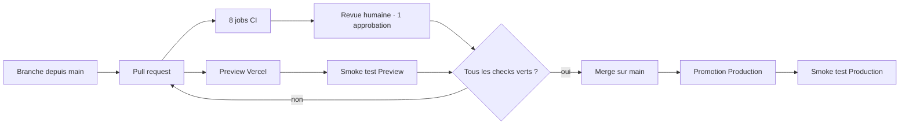

# Protection de branche et discipline de contribution

> **Statut de ce document : configuration *prescrite*, pas configuration *constatée*.**
> Les réglages GitHub ne sont pas lisibles depuis le dépôt : ce fichier décrit ce
> qui doit être appliqué sur `main` et comment le vérifier. Tant que la vérification
> n'a pas été exécutée par une personne disposant des droits d'administration, le
> contrôle correspondant reste `NOT_VERIFIED` dans
> [`READINESS_REPORT.md`](./READINESS_REPORT.md).

| | |
|---|---|
| Dépôt | `ludoviclabs-dotcom/PROBANT` |
| Branche protégée | `main` |
| Dernière mise à jour | 14/08/2026 |

---

## 1. Règles à appliquer sur `main`

| Réglage | Valeur | Pourquoi |
|---|---|---|
| Require a pull request before merging | **activé** | Aucune écriture directe sur `main` ; chaque changement a une trace de revue. |
| Required approvals | **1 minimum** | Un dossier d'audit doit pouvoir nommer un relecteur. |
| Dismiss stale approvals on new commits | **activé** | Une approbation porte sur un diff, pas sur une branche. |
| Require review from Code Owners | activé si `CODEOWNERS` existe | Les zones sensibles (`lib/auth/`, `drizzle/`, `.github/`) ne se relisent pas au hasard. |
| Require status checks to pass | **activé** | Voir § 2. |
| Require branches to be up to date | **activé** | Empêche le « merge vert » d'une branche testée contre une base obsolète. |
| Require conversation resolution | **activé** | Une remarque de revue non traitée ne disparaît pas au merge. |
| Require linear history | activé | Historique lisible pour la reconstitution d'un dossier. |
| Allow force pushes | **désactivé** | Un historique réécrit détruit la traçabilité des décisions. |
| Allow deletions | **désactivé** | — |
| Do not allow bypassing the above settings | **activé** | Y compris pour les administrateurs : une exception non tracée est une exception invisible. |
| Require signed commits | recommandé | À activer une fois la signature outillée pour tous les contributeurs. |

## 2. Checks obligatoires

Noms exacts des jobs de [`ci.yml`](../../.github/workflows/ci.yml), à cocher dans
« Require status checks to pass » :

| Check | Rôle | Bloquant |
|---|---|:--:|
| `lint · typecheck · test · build` | Barrière de non-régression principale | ✅ |
| `migrations · aller-retour` | Migrations reproductibles **et** réversibles | ✅ |
| `fixtures d'ingestion` | Fichiers hostiles et limites de parsing | ✅ |
| `E2E Playwright · axe` | Quatre parcours + accessibilité des 7 pages | ✅ |
| `dependency scan · SBOM` | `npm audit --audit-level=high` bloquant, SBOM publié | ✅ |
| `CodeQL` | Analyse statique de sécurité | ✅ |
| `secret scan` | Historique complet, secrets vérifiés | ✅ |
| `Lighthouse CI` | Mesure de laboratoire | ⚠️ non bloquant sur le score global ; **bloquant** sur LCP et CLS |

Le déploiement Preview de Vercel (`vercel[bot]`) doit également être requis :
un merge dont la Preview a échoué ne peut pas être promu en Production.

## 3. Séquence attendue d'une contribution



Chaque PR de la séquence PR-00 → PR-08 colle en outre le bloc **PR GATE** de
[`SUIVI_AVANCEMENT.md`](../refonte/SUIVI_AVANCEMENT.md), rempli honnêtement :
`NOT RUN` est une réponse valide, un faux vert ne l'est pas.

## 4. Smoke test — Preview et Production

Liste minimale, à exécuter manuellement après chaque déploiement. Elle ne
remplace pas les E2E : elle vérifie que l'**environnement déployé** se comporte
comme l'artefact testé.

| # | Contrôle | Attendu |
|---|---|---|
| 1 | `GET /` | 200, page d'accueil rendue |
| 2 | En-têtes de `/dashboard/synthese` | `x-content-type-options: nosniff`, `referrer-policy`, `permissions-policy`, CSP présente |
| 3 | `GET /dashboard/synthese` | Verdict et empreinte de snapshot affichés |
| 4 | `GET /api/auth/session` sans cookie | `{"authenticated":false}`, `cache-control: private, no-store` |
| 5 | `GET /api/export` | 405 avec `Allow: POST` |
| 6 | `POST /api/dossiers/<uuid>/snapshot` sans identité | 401, jamais 200 |
| 7 | Dépôt d'un fichier `.docx` | Rejet explicable, aucun constat créé |
| 8 | `POST /api/rum` avec un lot valide | 204 |
| 9 | Mode persistant configuré | `GET /api/auth/login` redirige vers l'IdP (302) |
| 10 | Journal du déploiement | Aucun libellé comptable, aucun nom de tiers, aucun jeton |

Commande de vérification des en-têtes (à exécuter contre l'URL déployée) :

```bash
curl -sSI https://<deployment-url>/dashboard/synthese | grep -Ei 'content-security-policy|x-content-type-options|referrer-policy|permissions-policy|strict-transport-security'
```

## 5. Comment vérifier la configuration réellement appliquée

La protection de branche n'est pas dans le dépôt : elle se lit par l'API. À
exécuter avec un jeton disposant du droit `administration:read`.

```bash
gh api repos/ludoviclabs-dotcom/PROBANT/branches/main/protection --jq '{pr: .required_pull_request_reviews, checks: .required_status_checks.contexts, force_push: .allow_force_pushes.enabled, admins: .enforce_admins.enabled}'
```

Tant que cette commande n'a pas été exécutée et son résultat consigné ici,
le contrôle `github.branch_protection` reste `NOT_VERIFIED` — au même titre
qu'une région Vercel non prouvée. Voir
[`SOURCE_AUDIT.md`](./SOURCE_AUDIT.md) § 4.

## 6. Zones à protéger par `CODEOWNERS`

Fichier à créer à la racine ou dans `.github/` :

```text
/lib/auth/            @ludoviclabs-dotcom
/drizzle/             @ludoviclabs-dotcom
/.github/workflows/   @ludoviclabs-dotcom
/docs/adr/            @ludoviclabs-dotcom
/middleware.ts        @ludoviclabs-dotcom
```

Ces chemins concentrent l'authentification, le schéma de données, la chaîne de
vérification et les décisions d'architecture : une modification non relue y a un
coût sans commune mesure avec le reste du dépôt.
